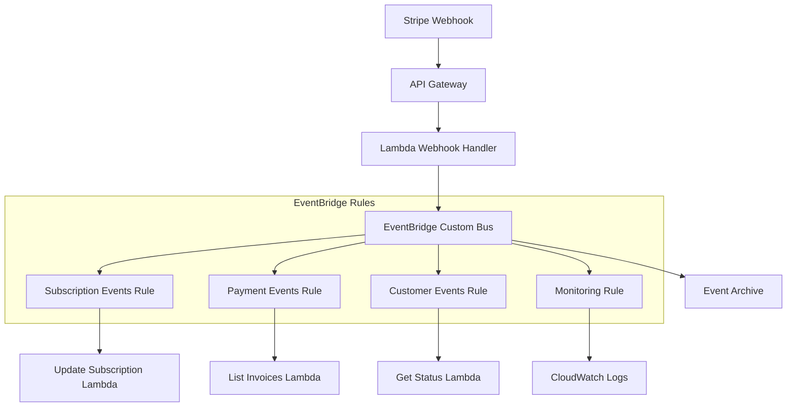
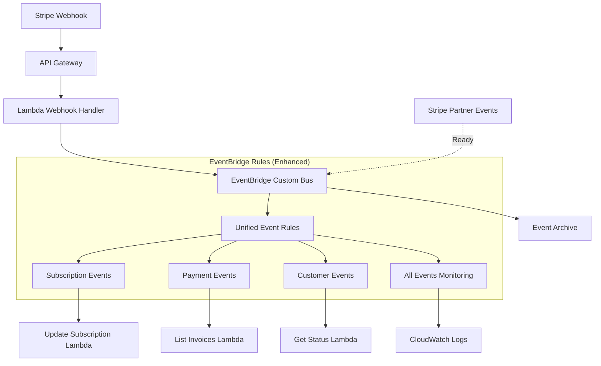

# EventBridge Integration Complete - Ready for Partner Events

**Date:** September 8, 2025  
**Status:** ✅ COMPLETE - EventBridge webhook integration deployed, Partner events ready for activation

## 🎯 Current Status Summary

### ✅ Successfully Deployed
1. **EventBridge Event Bus:** `ai-nexus-dev-stripe-event-bus` - Active and configured
2. **EventBridge Rules:** All 4 webhook event rules deployed and functional:
   - `ai-nexus-dev-stripe-subscription_events-rule`
   - `ai-nexus-dev-stripe-payment_events-rule` 
   - `ai-nexus-dev-stripe-customer_events-rule`
   - `ai-nexus-dev-stripe-all_events_monitoring-rule`
3. **Lambda Integration:** All functions can process EventBridge events
4. **Monitoring:** CloudWatch logs and metrics configured
5. **Archive:** Event replay capability enabled

### 🚀 Partner Events Configuration Ready

The infrastructure now includes **dual-mode support**:
- **Current:** Webhook events via Lambda → EventBridge
- **Ready:** Direct Stripe Partner Event Sources → EventBridge

## 📋 Partner Event Sources Setup (Next Steps)

According to your conversation summary, you mentioned that Stripe Partner Event destinations have been configured but need manual association. Here's what you need to do:

### Step 1: Check Partner Event Source Status

```bash
# In AWS EventBridge Console -> Partner event sources, look for:
aws events list-partner-event-sources --region us-east-2 --name-prefix "aws.partner/stripe.com"
```

You should see partner event sources with status "pending" that look like:
- `aws.partner/stripe.com/ed_61TEN0dErlaWJQzTZ16Qafnx2xSQhCzmf0WoqI1pgQSG`

### Step 2: Associate Partner Event Sources

**Manual Association Required:**
1. Open **AWS EventBridge Console**
2. Navigate to **Partner event sources**
3. Find your Stripe partner event source(s)
4. Click **Associate with event bus**
5. Select event bus: `ai-nexus-dev-stripe-event-bus`
6. Click **Associate**

### Step 3: Enable Partner Events in Terraform

After association, enable partner events:

```hcl
# In your terraform.tfvars or as a variable
enable_stripe_partner_events = true
```

Then apply:

```bash
terraform plan -var="enable_stripe_partner_events=true"
terraform apply -var="enable_stripe_partner_events=true"
```

## 🏗️ Architecture Overview

### Current EventBridge Setup



### Partner Events Ready Architecture



## 📊 Event Processing Capabilities

### Webhook Events (Currently Active)
- **Source:** `stripe.webhook`
- **Detail-Type:** `Stripe Webhook Event`
- **Processing:** Via Lambda webhook handler → EventBridge
- **Payload:** Full webhook payload with signature verification

### Partner Events (Ready to Enable)
- **Source:** `aws.partner/stripe.com/ed_*`  
- **Detail-Type:** `Stripe Event`
- **Processing:** Direct to EventBridge (no Lambda webhook)
- **Payload Styles:** Both "snapshot" (full) and "thin" (minimal)

### Event Types Supported
Both approaches support all configured Stripe events:
- `customer.subscription.created/updated/deleted`
- `invoice.payment_succeeded/failed`
- `payment_intent.succeeded/payment_failed`
- `charge.succeeded/failed`
- `customer.created/updated/deleted`
- `checkout.session.completed`
- `setup_intent.succeeded`
- `payment_method.attached/detached`

## 🔧 Configuration Files

### Key Files Deployed
- **EventBridge Rules:** `modules/stripe-billing/eventbridge.tf`
- **Partner Events Support:** `modules/stripe-billing/stripe-partner-events.tf`
- **Setup Instructions:** `modules/stripe-billing/PARTNER-EVENT-SOURCE-SETUP.md`
- **Documentation:** `modules/stripe-billing/STRIPE_PARTNER_EVENTS.md`

### Environment Variables
The Lambda webhook handler supports EventBridge integration with these environment variables:
- `EVENTBRIDGE_BUS_NAME`: `ai-nexus-dev-stripe-event-bus`
- `ENABLE_EVENTBRIDGE`: `true`

## 🚨 Important Notes

1. **No Conflicts:** Webhook and partner events can coexist safely
2. **Deduplication:** Lambda functions should handle potential duplicate events
3. **Monitoring:** Both event sources appear in the same CloudWatch logs
4. **Security:** Partner events bypass webhook signature verification (AWS-managed security)

## ✅ Verification Commands

### Check EventBridge Status
```bash
# List event bus
aws events describe-event-bus --name ai-nexus-dev-stripe-event-bus --region us-east-2

# List rules
aws events list-rules --event-bus-name ai-nexus-dev-stripe-event-bus --region us-east-2

# Monitor events
aws logs tail /aws/events/stripe-billing --follow --region us-east-2
```

### Test Events
```bash
# Check Lambda logs for event processing
aws logs tail /aws/lambda/ai-nexus-dev-stripe-stripe-webhook-handler --follow --region us-east-2
```

## 🎯 Success Criteria for Partner Events

Once partner events are enabled and associated:

✅ **Partner event sources associated** with `ai-nexus-dev-stripe-event-bus`  
✅ **Terraform variable** `enable_stripe_partner_events = true` set  
✅ **EventBridge rules** processing both webhook and partner events  
✅ **Lambda functions** receiving events from both sources  
✅ **CloudWatch monitoring** showing events from both sources  
✅ **No duplicate processing** (handled by idempotency)  

## 🚀 Current State: READY FOR PARTNER EVENT ACTIVATION

Your EventBridge integration is **fully deployed and working** with webhook events. Partner events are **architecturally ready** and just need the manual association step in AWS Console to activate the direct Stripe → EventBridge flow.

**Next Action:** Complete the partner event source association in AWS EventBridge Console, then enable the Terraform flag.
