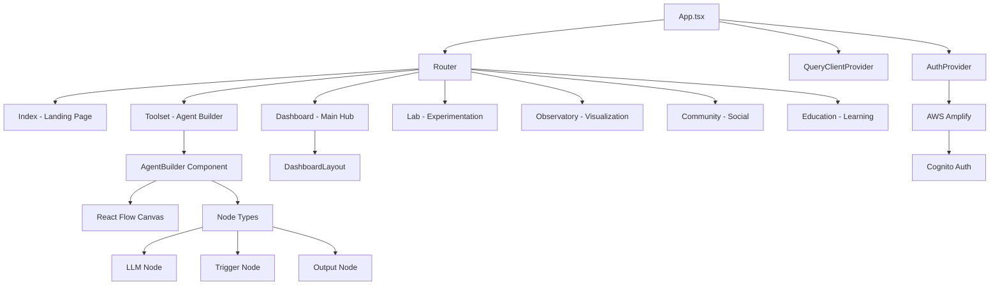

# WARP.md

This file provides guidance to WARP (warp.dev) when working with code in this repository.

> **Project:** diatonic-ai-platform  
> **Type:** React/TypeScript Web Application  
> **Framework:** Vite + React + shadcn/ui  
> **Generated:** 2025-01-07 20:23:00 UTC  

---

## Project Overview

Diatonic AI is a comprehensive React-based platform for AI development, featuring visual agent building, AWS integration, and a complete ecosystem for AI education and experimentation. It combines Flowise.ai-inspired drag-and-drop interfaces with DaVinci Resolve-inspired professional tools.

**Architecture:**
- **Frontend:** React 18 + TypeScript + Vite
- **UI Framework:** shadcn/ui components with Tailwind CSS
- **Authentication:** AWS Amplify with Cognito
- **Visual Flow:** React Flow (@xyflow/react) for agent building
- **State Management:** React Query + Context API
- **Routing:** React Router DOM v6

**Key Features:**
- Visual agent builder with drag-and-drop interface
- AWS Cognito authentication system
- Multiple workspaces (Dashboard, Lab, Observatory, Community)
- Responsive design with dark mode support
- Real-time collaboration capabilities (planned)

---

## Development Commands

### Core Development
```bash
# Install dependencies
npm install
# or
yarn install

# Development server
npm run dev          # Start Vite dev server on :8080
yarn dev

# Building
npm run build        # Production build
npm run build:dev    # Development build
yarn build

# Preview production build
npm run preview
yarn preview

# Code quality
npm run lint         # ESLint check
yarn lint
```

### Testing & Quality
```bash
# No test scripts currently defined - recommend adding:
# npm run test        # Run tests (Jest/Vitest)
# npm run test:watch  # Watch mode
# npm run test:coverage # Coverage report
```

---

## Architecture Overview



### Directory Structure (2 levels)
```
.
├── src/
│   ├── components/          # Reusable UI components
│   │   ├── ui/             # shadcn/ui components
│   │   ├── auth/           # Authentication components  
│   │   ├── agent-builder/  # Visual flow builder
│   │   └── layouts/        # Page layouts
│   ├── contexts/           # React contexts (Auth, etc.)
│   ├── hooks/              # Custom React hooks
│   ├── lib/                # Utilities and configurations
│   ├── pages/              # Route components
│   └── App.tsx             # Main application component
├── public/                 # Static assets
└── docs/                   # Project documentation
```

### Entry Points & Key Files
- **Main Entry:** `src/main.tsx` - React DOM root
- **App Root:** `src/App.tsx` - Main application with providers
- **Auth Context:** `src/contexts/AuthContext.tsx` - AWS Amplify integration
- **Agent Builder:** `src/components/agent-builder/AgentBuilder.tsx` - Visual flow interface
- **AWS Config:** `src/lib/aws-config.ts` - Multi-environment AWS setup

---

## Key Technologies & Dependencies

### Frontend Core
- **React** ^18.3.1 - UI library
- **TypeScript** ^5.5.3 - Type safety
- **Vite** ^5.4.1 - Build tool and dev server
- **React Router DOM** ^6.26.2 - Client-side routing
- **@tanstack/react-query** ^5.56.2 - Server state management

### UI & Styling
- **Tailwind CSS** ^3.4.11 - Utility-first CSS
- **shadcn/ui** components - High-quality React components
- **Lucide React** ^0.462.0 - Icons
- **@radix-ui** components - Headless UI primitives
- **next-themes** ^0.3.0 - Dark mode support

### AWS Integration
- **aws-amplify** ^6.15.5 - AWS SDK and authentication
- **@aws-sdk/client-cognito-identity-provider** ^3.883.0 - Cognito auth
- **@aws-sdk/client-dynamodb** ^3.883.0 - Database operations
- **@aws-sdk/client-s3** ^3.883.0 - File storage

### Specialized Features
- **@xyflow/react** ^12.6.0 - Visual flow/graph building
- **recharts** ^2.12.7 - Data visualization
- **react-hook-form** ^7.53.0 - Form management
- **zod** ^3.23.8 - Schema validation
- **sonner** ^1.5.0 - Toast notifications

### Development Tools
- **ESLint** ^9.9.0 - Code linting
- **TypeScript ESLint** ^8.0.1 - TypeScript-specific linting
- **Autoprefixer** ^10.4.20 - CSS vendor prefixes
- **PostCSS** ^8.4.47 - CSS processing

---

## Important Patterns & Conventions

### Authentication Flow
```typescript
// AWS Amplify integration with multi-environment support
const AuthContext = createContext<AuthContextType>();
// Supports sign-in, sign-up, password recovery, session management
// Environment-specific configuration (dev/staging/prod)
```

### Visual Flow Builder Architecture
```typescript
// Node-based architecture for AI agent creation
interface BaseNodeData {
  label: string;
  [key: string]: unknown;
}

// Specialized node types
type NodeTypes = 'trigger' | 'llm' | 'output';
// React Flow integration with custom node components
```

### UI Component Architecture
- **shadcn/ui pattern:** Radix UI + Tailwind CSS + custom variants
- **Layout components:** Consistent page layouts with sidebars
- **Theme system:** CSS custom properties with dark/light modes
- **Responsive design:** Mobile-first approach with breakpoints

### State Management Patterns
- **React Query:** Server state caching and synchronization
- **Context API:** Authentication and global state
- **Local state:** useState/useReducer for component state
- **Custom hooks:** Reusable stateful logic (useFlowLogic, useAuth)

### AWS Integration Patterns
```typescript
// Multi-environment configuration
const getAWSConfig = (): AWSConfig => {
  const environment = getEnvironment();
  // Development/staging/production configs
  return environmentConfigs[environment];
};

// Service initialization with validation
export const validateAWSConfig = (): boolean => {
  // Ensure required AWS services are configured
};
```

---

## Configuration & Environment

### Environment Variables (names only)
Required for AWS integration:
- `VITE_AWS_REGION` - AWS region (e.g., us-east-2)
- `VITE_AWS_COGNITO_USER_POOL_ID` - Cognito user pool
- `VITE_AWS_COGNITO_USER_POOL_CLIENT_ID` - Cognito client ID
- `VITE_AWS_COGNITO_IDENTITY_POOL_ID` - Cognito identity pool
- `VITE_AWS_API_GATEWAY_ENDPOINT` - API Gateway URL
- `VITE_AWS_S3_BUCKET` - S3 bucket name
- `VITE_APP_NAME` - Application name
- `VITE_APP_VERSION` - Version string
- `VITE_ENABLE_DEBUG_LOGS` - Debug logging flag
- `VITE_ENABLE_ANALYTICS` - Analytics flag

### Configuration Files
- **Vite:** `vite.config.ts` - Build configuration with aliases
- **TypeScript:** `tsconfig.json` - Project references and paths
- **Tailwind:** `tailwind.config.ts` - Custom theme and animations
- **ESLint:** `eslint.config.js` - Modern flat config format
- **shadcn/ui:** `components.json` - Component library configuration

---

## Development Workflow

### Getting Started
1. **Clone and setup:**
   ```bash
   git clone <repository-url>
   cd diatonic-ai-platform
   npm install
   cp .env.example .env.local  # Configure AWS credentials
   ```

2. **Start development:**
   ```bash
   npm run dev  # Starts on http://localhost:8080
   ```

3. **AWS Setup:**
   - Configure Cognito user pools
   - Set up API Gateway endpoints  
   - Configure S3 buckets for file storage

### Component Development
- Use shadcn/ui components as base: `npx shadcn@latest add button`
- Follow TypeScript strict patterns
- Implement responsive design with Tailwind
- Add proper error boundaries and loading states

### Agent Builder Development
- Extend node types in `src/components/agent-builder/types.ts`
- Implement new node components following existing patterns
- Use React Flow's node and edge APIs for interactions
- Maintain type safety throughout the flow system

---

## Testing Strategy

### Current Status
No test framework currently configured. Recommended setup:

```bash
# Add testing dependencies
npm install --save-dev vitest @testing-library/react @testing-library/jest-dom
npm install --save-dev @vitejs/plugin-react jsdom
```

### Recommended Test Structure
- **Unit tests:** Component logic and utilities
- **Integration tests:** Auth flows, API integration
- **E2E tests:** Critical user journeys (Playwright/Cypress)
- **Visual tests:** Storybook for component library

---

## Helpful Tools (MCP)

**Recommended MCP tools for this codebase:**
- **`nodejs-inspector`** - Analyze dependencies, scripts, and package management
- **`git-operations`** - Git repository management and workflow automation  
- **`markdown-processor`** - Process documentation and README files
- **`file-system-manager`** - Enhanced file operations and directory management
- **`data-transformer`** - Transform JSON/YAML configuration files

**Quick MCP Commands:**
```bash
mcp list-tools                    # View available tools
mcp connect nodejs-inspector      # Analyze Node.js project
mcp connect git-operations        # Git workflow assistance
```

---

## Troubleshooting & Common Issues

### Development Server Issues
```bash
# Clear Vite cache and restart
rm -rf node_modules/.vite
npm run dev

# Clear npm cache
npm cache clean --force
rm -rf node_modules package-lock.json
npm install
```

### AWS Authentication Issues
- Verify environment variables are set correctly
- Check Cognito user pool configuration
- Ensure AWS region consistency across services
- Use browser dev tools to inspect authentication errors

### Build Issues
```bash
# Type checking
npx tsc --noEmit

# ESLint check
npm run lint

# Clear build artifacts
rm -rf dist
npm run build
```

### React Flow Issues
- Ensure proper node data structure matches TypeScript interfaces
- Check for proper edge connections between nodes
- Verify React Flow CSS is imported: `import '@xyflow/react/dist/style.css'`

---

## Project-Specific Rules

### Code Style
- Use TypeScript strict mode
- Prefer function declarations for components  
- Use absolute imports with `@/` alias
- Follow shadcn/ui component patterns
- Implement proper error boundaries

### AWS Integration
- Always validate AWS configuration on initialization
- Handle authentication errors gracefully
- Use environment-specific configurations
- Never commit AWS credentials to version control

### Agent Builder
- Maintain type safety in node definitions
- Follow React Flow best practices for performance
- Implement proper validation for node connections
- Use the established node data interfaces

---

## Documentation & Resources

### Project Documentation
- **README.md** - Basic setup and overview
- **TECHNICAL_STACK.md** - Comprehensive technical architecture
- **UI_DESIGN.md** - Design principles and UI specifications
- **.env.example** - Environment variable template

### External Resources
- [Vite Documentation](https://vitejs.dev/) - Build tool
- [React Flow Docs](https://reactflow.dev/) - Visual flow building
- [shadcn/ui](https://ui.shadcn.com/) - Component library
- [AWS Amplify Docs](https://docs.amplify.aws/) - AWS integration
- [Tailwind CSS](https://tailwindcss.com/) - Styling framework

---

## Metadata

- **WARP Version:** 2.0.0
- **Last Updated:** 2025-01-07 20:23:00 UTC  
- **Project Type:** React/TypeScript SPA with AWS Integration
- **Working Logs:** `~/Documents/working-warp/diatonic-ai-platform__20250107-202300/`

---

*This WARP.md provides comprehensive guidance for development workflow, architecture understanding, and project navigation. Keep it updated as the project evolves.*
