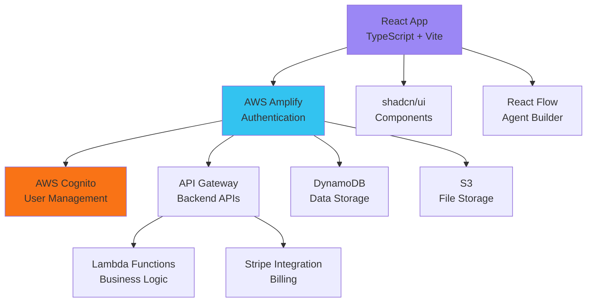
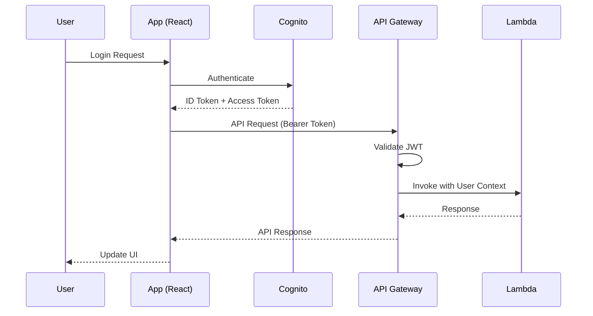

# WARP.md - AI Nexus Workbench

This file provides comprehensive guidance for AI LLM development and contribution to the AI Nexus Workbench repository.

> **Project:** AI Nexus Workbench  
> **Type:** React/TypeScript Web Application with AWS Integration  
> **Framework:** Vite + React + shadcn/ui + AWS Amplify  
> **Generated:** 2025-09-16 20:23:45 UTC  
> **WARP Version:** 3.0.0  

---

## 🎯 Project Overview

The AI Nexus Workbench is a comprehensive React-based platform for AI development, featuring:

- **Visual Agent Builder**: Drag-and-drop interface using React Flow for creating AI agents
- **AWS Cognito Authentication**: Secure user management with multi-environment support
- **Integrated Billing System**: Stripe integration with multiple pricing tiers
- **Lead Management System**: Comprehensive lead capture and analytics
- **Multi-Workspace Architecture**: Dashboard, Lab, Observatory, Community, Education
- **Responsive Design**: Built with Tailwind CSS and shadcn/ui components

### Current Architecture Stack



---

## 🏗️ Architecture Maps

### Application Architecture

**Frontend Stack:**
- React 18.3.1 + TypeScript 5.5.3
- Vite 6.3.6 (build tool)
- React Router DOM 6.26.2 (client-side routing)
- @tanstack/react-query 5.56.2 (server state)
- @xyflow/react 12.6.0 (visual flow building)

**UI Framework:**
- shadcn/ui components (189 usages detected)
- Tailwind CSS 3.4.11 (1,930+ utility classes used)
- Radix UI primitives
- Lucide React 0.462.0 (icons)
- next-themes 0.3.0 (dark mode)

**AWS Integration:**
- aws-amplify 6.15.5
- @aws-sdk/client-cognito-identity-provider 3.883.0
- @aws-sdk/client-dynamodb 3.883.0
- @aws-sdk/client-s3 3.883.0
- @aws-lambda-powertools/* (logging, metrics, tracing)

### Directory Structure

```
src/
├── components/               # Reusable UI components
│   ├── ui/                  # shadcn/ui base components
│   ├── auth/                # Authentication components
│   ├── agent-builder/       # Visual flow builder components
│   ├── admin/               # Admin dashboard components
│   ├── billing/             # Stripe billing components
│   ├── education/           # Education module components
│   ├── onboarding/          # User onboarding flow
│   ├── pricing/             # Pricing page components
│   └── layouts/             # Page layout components
├── contexts/                # React contexts (Auth, Theme, etc.)
├── hooks/                   # Custom React hooks
├── lib/                     # Utilities and configurations
│   └── api/                 # API client modules
├── pages/                   # Route-level components
│   └── services/            # Service landing pages
├── services/                # Backend services
│   └── billing/             # Stripe billing service
├── types/                   # TypeScript type definitions
└── validation/              # Zod validation schemas
```

### Routing Architecture

**Main Routes (from App.tsx):**
```typescript
// Public routes
/ (Index)
/pricing
/about, /blog, /contact, /careers
/terms, /privacy, /cookies, /licenses

// Authentication routes
/auth/signin, /auth/signup, /auth/confirm, /auth/callback

// Protected routes (require auth)
/dashboard - ProtectedRoute(requireAuth: true)
/toolset - ProtectedRoute(requiredPermission: "studio.create_agents")
/lab - ProtectedRoute(requiredPermission: "lab.run_basic_experiments")
/observatory - ProtectedRoute(requiredPermission: "observatory.basic_analytics")
/admin - ProtectedRoute(requiredPermission: "internal.content_management")

// Mixed access
/community - ConditionalRoute(allowAnonymous: true)
/education - Open access

// Service landing pages
/services/toolset, /services/lab, /services/observatory, /services/community, /services/education
```

---

## 🛠️ Development Environment and Commands

### Prerequisites

- Node.js 18+ and npm/yarn/pnpm
- AWS Account with Cognito, API Gateway, DynamoDB, Lambda access
- Stripe Account for billing integration (optional for development)

### Installation & Setup

```bash
# Clone repository
git clone https://github.com/iamdrewfortini/ai-nexus-workbench.git
cd ai-nexus-workbench

# Install dependencies
npm install

# Copy environment template
cp .env.example .env.local

# Configure your environment variables (see Infrastructure section)
# Edit .env.local with your AWS and application settings
```

### Available Scripts

```bash
# Development
npm run dev                   # Launch dev server with helper scripts
npm run dev:direct            # Direct Vite dev server (port 8080)
npm run dev:background        # Background dev server
npm run dev:verify            # Verify dev setup

# Building & Preview
npm run build                 # Production build with browserslist update
npm run build:dev             # Development build
npm run build:analyze         # Build with bundle analyzer
npm run preview               # Preview production build

# Quality & Linting
npm run lint                  # ESLint check
npm run clean                 # Clean build artifacts

# Database Operations (DynamoDB Local)
npm run dynamodb:start        # Start local DynamoDB
npm run dynamodb:stop         # Stop local DynamoDB
npm run dynamodb:status       # Check status
npm run dynamodb:reset        # Reset local data
npm run dynamodb:setup        # Setup local tables
npm run dynamodb:admin        # Launch admin UI

# Database Migrations & Sync
npm run dynamodb:sync-from-cloud    # Sync schema from cloud
npm run dynamodb:deploy-to-cloud    # Deploy schema to cloud
npm run dynamodb:validate           # Validate schema
npm run db:migrate                  # Run migrations
npm run db:setup                    # Setup production DynamoDB

# Docker Development
npm run docker:up             # Start Docker services
npm run docker:down           # Stop Docker services
npm run docker:logs           # View Docker logs

# API Development
npm run api:start             # Start API server
npm run api:dev               # Start API in dev mode
npm run api:test              # Test API endpoints

# Full Development Environment
npm run dev:full              # Docker + DB setup + dev server
npm run dev:with-api          # API server + web dev concurrently
```

---

## 🏭 Infrastructure (AWS) and Environment Variables

### AWS Services Integration

**Core Services:**
- **AWS Cognito**: User authentication and management
- **API Gateway**: REST API endpoints for backend services
- **Lambda**: Serverless functions for business logic
- **DynamoDB**: NoSQL database for scalable data storage
- **S3**: Object storage for files and assets
- **CloudFront**: CDN for global content delivery (optional)

**Security & Monitoring:**
- **AWS IAM**: Identity and access management
- **AWS CloudWatch**: Logging and monitoring
- **AWS Secrets Manager**: Secure secrets storage
- **AWS Systems Manager Parameter Store**: Configuration management

### Environment Variables (Required)

**⚠️ SECURITY NOTICE:** Never commit actual values to version control. Use AWS Secrets Manager or Systems Manager Parameter Store for production secrets.

#### AWS Configuration
```bash
# Core AWS Settings
VITE_AWS_REGION=us-east-2                    # AWS region
VITE_NODE_ENV=development                    # Environment mode

# AWS Cognito Authentication
VITE_AWS_COGNITO_USER_POOL_ID=your-user-pool-id
VITE_AWS_COGNITO_USER_POOL_CLIENT_ID=your-client-id
VITE_AWS_COGNITO_IDENTITY_POOL_ID=your-identity-pool-id
VITE_AWS_COGNITO_USER_POOL_DOMAIN=your-cognito-domain

# API Gateway
VITE_API_GATEWAY_URL=https://your-api-gateway-url.amazonaws.com
VITE_API_GATEWAY_STAGE=dev

# Storage Services
VITE_S3_BUCKET_NAME=your-s3-bucket-name
VITE_S3_REGION=us-east-2
VITE_CLOUDFRONT_DOMAIN=your-cloudfront-domain.cloudfront.net

# DynamoDB Table References
VITE_DYNAMODB_USER_DATA_TABLE=your-user-data-table
VITE_DYNAMODB_FILES_TABLE=your-files-table
VITE_DYNAMODB_SESSIONS_TABLE=your-sessions-table
```

#### Application Configuration
```bash
# Application Identity
VITE_APP_NAME="AI Nexus Workbench"
VITE_APP_VERSION=1.0.0
VITE_APP_DOMAIN=localhost:8080
VITE_APP_URL=http://localhost:8080

# Feature Flags
VITE_ENABLE_FILE_UPLOAD=true
VITE_ENABLE_ANALYTICS=false
VITE_ENABLE_DEBUG_LOGGING=true
VITE_ENABLE_PERFORMANCE_MONITORING=false

# Security Features
VITE_ENABLE_CSP=true
VITE_ENABLE_HSTS=true
VITE_ENABLE_SECURE_HEADERS=true
```

#### Billing Integration (Stripe)
```bash
VITE_STRIPE_PUBLISHABLE_KEY=pk_test_your_publishable_key_here
VITE_STRIPE_MODE=test
VITE_TENANT_ID=diatonicvisuals
VITE_BILLING_API_URL=https://your-api-gateway-url.amazonaws.com/billing

# Stripe Price IDs (populated from Terraform outputs)
VITE_PRICE_PREMIUM_MONTHLY=price_premium_monthly_id
VITE_PRICE_PREMIUM_ANNUAL=price_premium_annual_id
VITE_PRICE_ENTERPRISE=price_enterprise_placeholder_id
```

#### Third-party Integrations (Optional)
```bash
VITE_SENTRY_DSN=your_sentry_dsn_here
VITE_GOOGLE_ANALYTICS_ID=your_ga_id_here
VITE_HOTJAR_ID=your_hotjar_id_here
```

---

## 🔄 Workflows (Dev → PR → CI → Deploy) and Quality Gates

### Development Workflow

1. **Local Development Setup**
   ```bash
   git checkout -b feature/your-feature-name
   npm install
   cp .env.example .env.local
   # Configure .env.local with your settings
   npm run dev
   ```

2. **Development Process**
   - Write code following TypeScript strict mode
   - Use shadcn/ui components for consistency
   - Follow React best practices and hooks patterns
   - Test changes locally with `npm run dev`

3. **Pre-commit Quality Checks**
   ```bash
   npm run lint          # ESLint validation
   npm run build         # Build validation
   npx tsc --noEmit      # TypeScript validation
   ```

### GitHub Workflow (CI/CD)

**Current Workflows:**
- `.github/workflows/deploy-amplify.yml` - AWS Amplify deployment
- `.github/workflows/deploy-dev.yml` - Development environment deployment

**Quality Gates (Recommended):**
- **On Pull Request:**
  - TypeScript compilation check
  - ESLint validation
  - Build success validation
  - Unit tests (when implemented)

- **On Main Branch Push:**
  - Full build validation
  - Integration tests (when implemented)
  - Deployment to staging/production

### Branch Protection Rules

**Recommended Configuration:**
- Require pull request reviews before merging
- Require status checks to pass before merging
- Require branches to be up to date before merging
- Include administrators in restrictions

---

## 🤖 LLM Development Rules (Definitive Guidelines)

### Agent Builder Development

**Node Architecture Contract:**
```typescript
// Base node data interface
interface BaseNodeData {
  id: string;
  type: 'trigger' | 'llm' | 'output' | 'transform' | 'condition';
  label: string;
  position: { x: number; y: number };
  data: {
    [key: string]: unknown;
  };
}

// LLM Node specific interface
interface LLMNodeData extends BaseNodeData {
  type: 'llm';
  data: {
    provider: 'openai' | 'anthropic' | 'bedrock' | 'custom';
    model: string;
    temperature: number;
    maxTokens: number;
    prompt: string;
    systemPrompt?: string;
    stopSequences?: string[];
  };
}
```

**Node Development Rules:**

1. **Schema Validation (MANDATORY)**
   ```typescript
   import { z } from 'zod';
   
   const llmNodeSchema = z.object({
     provider: z.enum(['openai', 'anthropic', 'bedrock', 'custom']),
     model: z.string().min(1),
     temperature: z.number().min(0).max(2),
     maxTokens: z.number().min(1).max(4096),
     prompt: z.string().min(1),
     systemPrompt: z.string().optional(),
     stopSequences: z.array(z.string()).optional(),
   });
   ```

2. **Error Handling Contract**
   ```typescript
   interface NodeExecutionResult {
     success: boolean;
     data?: any;
     error?: {
       code: string;
       message: string;
       retryable: boolean;
     };
   }
   ```

3. **Execution Contract**
   - All nodes MUST be idempotent
   - All nodes MUST handle abort signals
   - All nodes MUST provide progress updates for long-running operations
   - All nodes MUST implement timeout handling

### Prompt Engineering Guidelines

**Template Storage Pattern:**
```typescript
interface PromptTemplate {
  id: string;
  name: string;
  version: string;
  template: string;
  variables: Record<string, {
    type: 'string' | 'number' | 'boolean';
    required: boolean;
    description: string;
    default?: any;
  }>;
  metadata: {
    author: string;
    created: string;
    tags: string[];
    description: string;
  };
}
```

**Prompt Safety Rules:**
1. **Input Sanitization**: Always sanitize user inputs before including in prompts
2. **Injection Prevention**: Use parameterized templates, never string concatenation
3. **Content Filtering**: Implement content filters for both input and output
4. **Rate Limiting**: Implement per-user and per-endpoint rate limiting
5. **PII Protection**: Never log prompts containing potential PII

### Evaluation and Testing

**Evaluation Harness (Required for LLM features):**
```typescript
interface EvaluationMetric {
  name: string;
  type: 'accuracy' | 'relevance' | 'safety' | 'performance';
  scorer: (input: string, output: string, expected?: string) => number;
  threshold: number;
}

interface EvaluationSuite {
  id: string;
  name: string;
  dataset: Array<{
    input: string;
    expected?: string;
    metadata?: Record<string, any>;
  }>;
  metrics: EvaluationMetric[];
}
```

**Testing Requirements:**
- All LLM features MUST have evaluation suites
- Regression tests MUST run on every deployment
- Performance benchmarks MUST be maintained
- Safety evaluations MUST pass before production deployment

### Data Handling and Security

**Secrets Management (CRITICAL):**
```typescript
// ❌ NEVER DO THIS
const apiKey = "sk-your-actual-key-here";

// ✅ CORRECT APPROACH
import { SecretsManagerClient, GetSecretValueCommand } from "@aws-sdk/client-secrets-manager";

const getSecret = async (secretName: string) => {
  const client = new SecretsManagerClient({ region: process.env.AWS_REGION });
  const command = new GetSecretValueCommand({ SecretId: secretName });
  const response = await client.send(command);
  return response.SecretString;
};
```

**Client-Side Token Handling:**
- Use AWS Cognito Identity tokens exclusively
- Never store long-lived credentials in client code
- Implement token refresh logic properly
- Use secure storage (httpOnly cookies) when possible

---

## 🔒 Security and Compliance

### Client-Side Security

**Input Sanitization:**
```typescript
import DOMPurify from 'dompurify';

// Always sanitize user inputs
const sanitizeInput = (input: string): string => {
  return DOMPurify.sanitize(input, { 
    ALLOWED_TAGS: [],
    ALLOWED_ATTR: []
  });
};
```

**XSS Prevention:**
- Use React's built-in XSS protection
- Sanitize any dangerouslySetInnerHTML usage
- Validate all props and state updates
- Use Content Security Policy headers

**Error Handling:**
```typescript
// Structured error handling
interface AppError {
  code: string;
  message: string;
  userMessage?: string;
  retryable: boolean;
  logLevel: 'error' | 'warn' | 'info';
}

const handleError = (error: AppError, context?: string) => {
  // Log for developers (never include PII)
  console.error(`[${error.code}] ${context}: ${error.message}`);
  
  // Show user-friendly message
  toast.error(error.userMessage || "An unexpected error occurred");
  
  // Report to monitoring service (with PII filtering)
  if (error.logLevel === 'error') {
    reportError(error, context);
  }
};
```

### AWS Security Best Practices

**Authentication Flow:**


**Security Headers (Vite Configuration):**
```typescript
// vite.config.ts security headers
export default defineConfig({
  server: {
    headers: {
      'X-Frame-Options': 'DENY',
      'X-Content-Type-Options': 'nosniff',
      'Referrer-Policy': 'strict-origin-when-cross-origin',
      'Content-Security-Policy': "default-src 'self'; script-src 'self' 'unsafe-eval'; style-src 'self' 'unsafe-inline';",
    }
  }
});
```

**CORS Configuration:**
- Restrict origins to known domains
- Use specific methods (GET, POST, PUT, DELETE)
- Include credentials only when necessary
- Set appropriate max-age for preflight caching

### Compliance Requirements

**Data Privacy:**
- Implement proper consent management
- Provide data export functionality
- Support data deletion requests
- Maintain audit logs for data operations

**PII Handling:**
```typescript
interface UserData {
  id: string;
  email: string;     // PII - handle carefully
  profile: {
    firstName: string;  // PII
    lastName: string;   // PII
    preferences: Record<string, any>; // Non-PII
  };
}

// PII filtering for logs
const sanitizeForLogging = (data: any): any => {
  const sanitized = { ...data };
  delete sanitized.email;
  delete sanitized.firstName;
  delete sanitized.lastName;
  return sanitized;
};
```

---

## 🧪 Testing Strategy and Coverage Targets

### Current Status

**Testing Infrastructure:** Not currently implemented
**Recommendation:** Implement comprehensive testing strategy

### Proposed Testing Setup

**Unit Testing:**
```bash
npm install --save-dev vitest @testing-library/react @testing-library/jest-dom jsdom
```

**Integration Testing:**
```bash
npm install --save-dev msw   # Mock service worker for API mocking
```

**End-to-End Testing:**
```bash
npm install --save-dev playwright  # or cypress
```

### Testing Architecture

```typescript
// vitest.config.ts
import { defineConfig } from 'vitest/config';
import react from '@vitejs/plugin-react-swc';

export default defineConfig({
  plugins: [react()],
  test: {
    globals: true,
    environment: 'jsdom',
    setupFiles: ['./src/test/setup.ts'],
    coverage: {
      reporter: ['text', 'json', 'html'],
      thresholds: {
        global: {
          branches: 70,
          functions: 70,
          lines: 70,
          statements: 70
        }
      }
    }
  },
  resolve: {
    alias: {
      '@': path.resolve(__dirname, './src'),
    }
  }
});
```

### Testing Guidelines

**Component Testing:**
```typescript
// src/components/ui/Button.test.tsx
import { render, screen, fireEvent } from '@testing-library/react';
import { describe, it, expect, vi } from 'vitest';
import { Button } from './Button';

describe('Button', () => {
  it('renders with correct text', () => {
    render(<Button>Click me</Button>);
    expect(screen.getByRole('button')).toHaveTextContent('Click me');
  });

  it('calls onClick handler', () => {
    const onClick = vi.fn();
    render(<Button onClick={onClick}>Click me</Button>);
    fireEvent.click(screen.getByRole('button'));
    expect(onClick).toHaveBeenCalledTimes(1);
  });
});
```

**Agent Builder Testing:**
```typescript
// src/components/agent-builder/AgentBuilder.test.tsx
import { render, screen } from '@testing-library/react';
import { ReactFlowProvider } from '@xyflow/react';
import { AgentBuilder } from './AgentBuilder';

describe('AgentBuilder', () => {
  const renderWithProviders = (component: React.ReactElement) => {
    return render(
      <ReactFlowProvider>
        {component}
      </ReactFlowProvider>
    );
  };

  it('renders flow canvas', () => {
    renderWithProviders(<AgentBuilder />);
    expect(screen.getByTestId('react-flow')).toBeInTheDocument();
  });
});
```

**Coverage Targets:**
- **Initial Target:** 70% line coverage
- **Long-term Target:** 80% line coverage
- **Critical Paths:** 90% coverage (auth, billing, agent execution)

---

## 🛠️ MCP Tools and Usage Rules

### MCP Integration Guidelines

**Index Management:**
- MCP tools index MUST be refreshed every 24 hours
- Index location: `.warp/mcp-index.json`
- Human-readable index: `WARP-MCP-Index.md`

**Tool Usage Hierarchy (Least Privilege):**
1. **Read-only operations:** No approval required
2. **Write operations:** Require explicit approval
3. **System modifications:** Require plan → confirm → execute

### Recommended MCP Tools for AI Nexus Workbench

**Primary Development Tools:**
- **`nodejs-inspector`**: Analyze dependencies, scripts, and package management
- **`git-operations`**: Git repository management and workflow automation
- **`file-system-manager`**: Enhanced file operations and directory management

**AWS Integration Tools:**
- **`aws-cli-helper`**: AWS service management and configuration
- **`dynamodb-inspector`**: Database schema and data management
- **`lambda-debugger`**: Lambda function development and testing

**AI/LLM Specific Tools:**
- **`prompt-validator`**: Validate and test prompts for safety and effectiveness
- **`model-benchmarker`**: Performance testing for LLM integrations
- **`token-counter`**: Estimate token usage and costs

**Code Quality Tools:**
- **`typescript-analyzer`**: Advanced TypeScript code analysis
- **`react-flow-validator`**: Validate React Flow node implementations
- **`security-scanner`**: Security vulnerability detection

### Write Gates and Approval Process

**Write Operations Requiring Approval:**
```json
{
  "operation": "write",
  "tools": [
    "git-operations__create_branch",
    "file-system-manager__write_file",
    "aws-cli-helper__deploy_lambda"
  ],
  "rollback": "Revert changes via git reset or AWS resource deletion",
  "approved": false
}
```

**Approval Criteria:**
- Clear description of changes
- Rollback plan defined
- Security implications assessed
- No secrets in code changes

---

## ❌ Do-Not-Touch Areas and Migration Notes

### Protected Areas

**Critical Files (Require Special Review):**
- `src/contexts/AuthContext.tsx` - Core authentication logic
- `src/lib/api/dynamodb-client.ts` - Database connection logic
- `vite.config.ts` - Build configuration with security headers
- `package.json` - Dependency management

**AWS Resources (Production):**
- Cognito User Pools - Changes affect all users
- DynamoDB Tables - Schema changes require migration strategy
- Lambda Functions - Changes affect API availability
- S3 Buckets - Bucket policies affect file access

### Migration Guidelines

**Database Schema Changes:**
1. Create migration scripts in `migrations/` directory
2. Test on development environment first
3. Use DynamoDB schema migration tools
4. Maintain backward compatibility during transitions

**Authentication Changes:**
1. Test with development Cognito pool first
2. Validate token compatibility
3. Implement graceful fallback mechanisms
4. Coordinate with frontend and backend changes

**Breaking Changes Protocol:**
1. Create feature flag for new functionality
2. Maintain parallel implementations during transition
3. Communicate changes to all stakeholders
4. Provide clear migration timeline

---

## 🩹 Troubleshooting and Common Issues

### Development Server Issues

```bash
# Clear Vite cache and restart
rm -rf node_modules/.vite
npm run dev

# Clear npm cache if dependency issues
npm cache clean --force
rm -rf node_modules package-lock.json
npm install

# Docker development issues
npm run docker:down
npm run docker:up
sleep 5
npm run db:setup
```

### AWS Authentication Issues

**Common Problems:**
- Environment variables not configured correctly
- Cognito user pool configuration mismatch
- Token expiration not handled properly
- CORS issues with API Gateway

**Debugging Steps:**
```javascript
// Enable AWS debug logging
localStorage.setItem('aws-amplify-debugger', 'true');

// Check Cognito configuration
import { Auth } from 'aws-amplify';
console.log(Auth.configure());

// Verify token validity
const session = await Auth.currentSession();
console.log(session.getAccessToken().getJwtToken());
```

### Build and TypeScript Issues

```bash
# Type checking
npx tsc --noEmit

# ESLint check with fix
npm run lint --fix

# Clear build artifacts and rebuild
rm -rf dist
npm run build

# Check for circular dependencies
npx madge --circular src/
```

### Agent Builder Issues

**React Flow Common Issues:**
```typescript
// Ensure React Flow CSS is imported
import '@xyflow/react/dist/style.css';

// Verify node data structure matches interfaces
const nodeData: BaseNodeData = {
  id: 'unique-id',
  type: 'llm',
  label: 'LLM Node',
  position: { x: 0, y: 0 },
  data: { /* valid data structure */ }
};
```

**Performance Issues:**
- Use React.memo for node components
- Implement proper edge validation
- Use useCallback for event handlers
- Consider virtual scrolling for large flows

### Database Connection Issues

```bash
# Check DynamoDB local status
npm run dynamodb:status

# Reset local DynamoDB
npm run dynamodb:reset

# Verify table schemas
npm run dynamodb:validate

# Sync from cloud if needed
npm run dynamodb:sync-from-cloud
```

---

## 📋 Metadata and Working Logs

- **WARP Version:** 3.0.0
- **Last Updated:** 2025-09-16 20:23:45 UTC
- **Updated By:** AI Analysis System
- **Project Type:** React/TypeScript SPA with AWS Integration
- **Repository:** https://github.com/iamdrewfortini/ai-nexus-workbench.git
- **Current Branch:** main
- **Working Logs:** `~/Documents/working-warp/ai-nexus-workbench__20250916-202345/`

**Analysis Summary:**
- **Source Files:** 174 TypeScript/JavaScript files
- **React Components:** 129 components with React imports
- **Tailwind Usage:** 1,930+ utility classes
- **AWS Integration:** 40+ AWS SDK usages
- **shadcn/ui Components:** 189 component imports
- **React Flow Integration:** 15+ flow-related imports

---

## 🔗 External Resources

### Documentation
- [React Documentation](https://reactjs.org/) - Frontend framework
- [TypeScript Handbook](https://www.typescriptlang.org/docs/) - Type safety
- [Vite Guide](https://vitejs.dev/guide/) - Build tool and dev server
- [React Flow Documentation](https://reactflow.dev/) - Visual flow building
- [shadcn/ui Components](https://ui.shadcn.com/) - UI component library

### AWS Resources
- [AWS Amplify Documentation](https://docs.amplify.aws/) - AWS integration
- [AWS Cognito Developer Guide](https://docs.aws.amazon.com/cognito/) - Authentication
- [DynamoDB Developer Guide](https://docs.aws.amazon.com/dynamodb/) - Database
- [AWS Lambda Developer Guide](https://docs.aws.amazon.com/lambda/) - Serverless functions

### Development Tools
- [Tailwind CSS Documentation](https://tailwindcss.com/) - Utility-first CSS
- [React Query Documentation](https://tanstack.com/query/) - Server state management
- [Zod Documentation](https://zod.dev/) - TypeScript-first schema validation

---

*This WARP.md provides definitive rules and guidelines for AI LLM development and contribution to the AI Nexus Workbench. It reflects the actual current state of the repository and should be considered the authoritative source for development practices.*

**🔄 Next Review Scheduled:** 2025-12-16 (Quarterly Review)