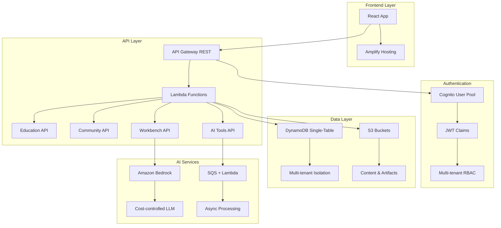
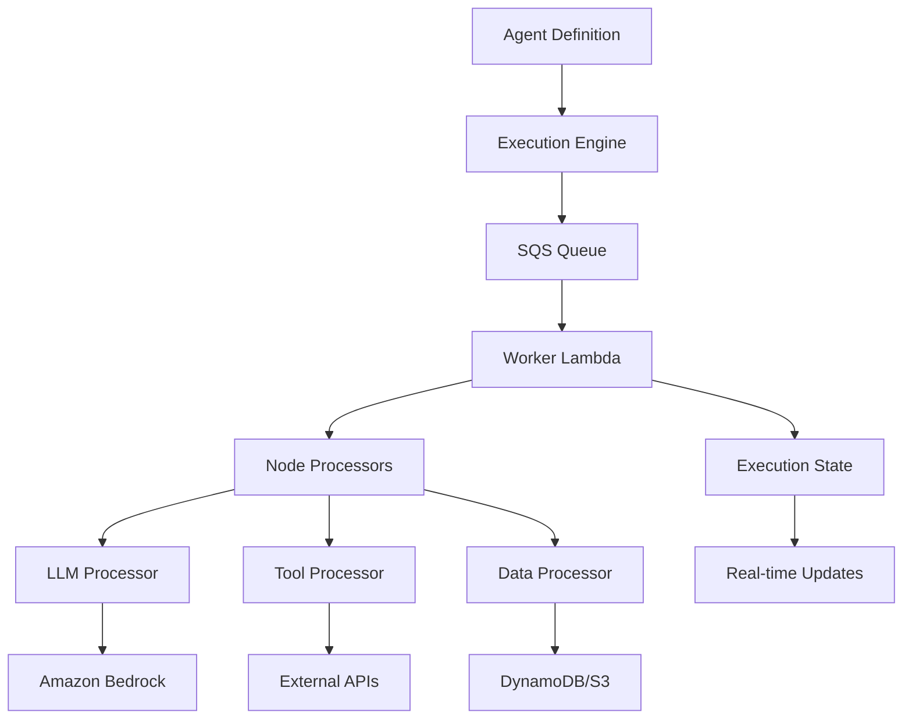

# 🏗️ Diatonic AI - Infrastructure Analysis & Development Plan

**Date:** 2025-09-16  
**Status:** Infrastructure Analysis & Strategic Planning  
**Focus:** Backend Implementation, AI Workbench/Toolset, Community Features  

---

## 🔍 Current Infrastructure Analysis

### **AWS Resources Discovered**

#### **US-EAST-2 (Ohio) - Primary Region**

**Amplify Applications:**
- `diatonic-ai-workbench-staging` (d3ddhluaptuu35) - Staging environment
- `diatonic-ai-workbench-development` (ddfry2y14h2zr) - Development environment

**API Gateways:**
- `diatonic-prod-api` (5kjhx136nd) - Production API
- `aws-devops-dev-api` (c2n9uk1ovi) - Development user management API
- `aws-devops-dev-main-api` (guwdd7u9v9) - Main API with webhook support

**Lambda Functions:**
- `aws-devops-dev-education-api` - Education service (already implemented)
- Additional Lambda functions detected

**DynamoDB Tables (61 tables):**
- Comprehensive schema for AI education modules
- Community, user profiles, agents, experiments
- Stripe billing integration
- Multi-tenant isolation implemented

**Cognito User Pools:**
- `diatonic-ai-platform-dev-user-pool` (us-east-2_xkNeOGMu1)
- `diatonic-prod-users` (us-east-2_hnlgmxl8t)
- Amplify backend manager pool

**S3 Buckets:**
- Static assets, user content, backups, logs
- Terraform state management
- MinIO integration for dev environment

#### **US-EAST-1 (N. Virginia)**
- No resources detected (good for cost control)

---

## 🎯 Current State Assessment

### **✅ Already Implemented**
1. **Education Backend** - Fully functional with CRUD operations
2. **Multi-tenant DynamoDB** - 61 tables with proper isolation
3. **User Authentication** - Cognito integration complete
4. **API Infrastructure** - Multiple API Gateways deployed
5. **Static Hosting** - Amplify apps for staging and development

### **🚧 Partial Implementation**
1. **AI Workbench/Toolset** - Frontend components exist, backend needs completion
2. **Community Features** - Basic UI implemented, backend functionality needs enhancement
3. **Agent Builder** - React Flow components exist, execution engine needed

### **❌ Missing Components**
1. **AI Education Module Management** - No admin interface for module creation/upload
2. **Real-time Collaboration** - Community features lack real-time updates
3. **AI Model Integration** - No Bedrock or AI service integration
4. **Advanced Workflow Execution** - Agent runs and experiment management incomplete

---

## 🏛️ Target Architecture Blueprint

### **Cost-Optimized Serverless Architecture**



---

## 🎓 AI Education Modules - Backend Implementation Plan

### **Priority 1: Module Management System**

#### **Required Endpoints**
```
POST /education/modules          - Create new module
PUT  /education/modules/{id}     - Update module
GET  /education/modules          - List modules (admin view)
DELETE /education/modules/{id}   - Delete module
POST /education/modules/{id}/upload - Upload module content
```

#### **Database Schema Extensions**
```javascript
// Education Modules Table
{
  module_id: "org:module:uuid",
  organization_id: "dev-org",
  title: "Introduction to Machine Learning",
  description: "Complete ML fundamentals course",
  content_type: "video|interactive|text|mixed",
  difficulty: "beginner|intermediate|advanced",
  estimated_duration: 120, // minutes
  prerequisites: ["module:uuid1", "module:uuid2"],
  learning_objectives: [],
  content_url: "s3://bucket/modules/uuid/",
  thumbnail_url: "s3://bucket/thumbnails/uuid.jpg",
  tags: ["ml", "ai", "fundamentals"],
  status: "draft|review|published|archived",
  created_by: "instructor-user-id",
  version: "1.0.0",
  created_at: "ISO-8601",
  updated_at: "ISO-8601"
}

// Module Content Table
{
  content_id: "org:content:uuid",
  module_id: "org:module:uuid", 
  section_order: 1,
  title: "What is Machine Learning?",
  content_type: "video|text|quiz|exercise",
  content_data: {}, // Flexible JSON structure
  duration: 15, // minutes
  status: "draft|published"
}
```

#### **S3 Storage Strategy**
```
s3://ai-nexus-dev-content/
├── modules/
│   ├── {module_id}/
│   │   ├── videos/
│   │   ├── documents/
│   │   ├── exercises/
│   │   └── metadata.json
├── thumbnails/
└── uploads/temp/ (24h lifecycle)
```

### **Priority 2: Content Upload Pipeline**

#### **Multi-step Upload Process**
1. **Frontend**: Request presigned URL from backend
2. **Backend**: Generate presigned S3 URLs with validation
3. **Frontend**: Upload directly to S3
4. **Backend**: Process uploaded content (Lambda trigger)
5. **Backend**: Update module metadata in DynamoDB

#### **Content Processing Lambda**
```javascript
// Triggered by S3 upload events
exports.handler = async (event) => {
  for (const record of event.Records) {
    const bucket = record.s3.bucket.name;
    const key = record.s3.object.key;
    
    // Validate file type and size
    // Extract metadata (video duration, document text, etc.)
    // Generate thumbnails for video content
    // Update DynamoDB with processed content info
    // Send notification to creator
  }
};
```

---

## 🛠️ AI Workbench & Toolset Implementation

### **Current State Analysis**
- ✅ React Flow components implemented
- ✅ Node types defined (LLM, Trigger, Output)
- ❌ Backend execution engine missing
- ❌ AI model integration incomplete

### **Priority 1: Agent Execution Engine**

#### **Required Endpoints**
```
POST /agents                     - Create agent
GET  /agents                     - List user agents
PUT  /agents/{id}                - Update agent
POST /agents/{id}/execute        - Start agent run
GET  /runs/{id}                  - Get run status
POST /runs/{id}/stop            - Stop running agent
GET  /runs/{id}/logs            - Stream execution logs
```

#### **Execution Architecture**


#### **Agent Execution Schema**
```javascript
// Agent Runs Table
{
  run_id: "org:run:uuid",
  agent_id: "org:agent:uuid",
  user_id: "user-123",
  organization_id: "dev-org",
  status: "queued|running|completed|failed|stopped",
  started_at: "ISO-8601",
  completed_at: "ISO-8601",
  execution_plan: {
    nodes: [], // Ordered execution plan
    current_node: 0,
    variables: {}
  },
  results: {
    outputs: {},
    logs: [],
    metrics: {}
  },
  error_details: null
}
```

### **Priority 2: AI Model Integration**

#### **Amazon Bedrock Integration**
```javascript
// Bedrock Service Module
class BedrockService {
  constructor(region = 'us-east-2') {
    this.bedrock = new BedrockRuntime({ region });
  }

  async invoke(modelId, prompt, options = {}) {
    // Rate limiting per tenant
    await this.checkRateLimit(options.tenantId);
    
    // Token limit enforcement
    const truncatedPrompt = this.truncatePrompt(prompt, options.maxTokens || 1000);
    
    // Invoke model with streaming
    const response = await this.bedrock.invokeModelWithResponseStream({
      modelId,
      body: JSON.stringify({
        prompt: truncatedPrompt,
        max_tokens: options.maxTokens || 1000,
        temperature: options.temperature || 0.7
      }),
      contentType: 'application/json'
    });

    return this.processStreamingResponse(response);
  }
}
```

#### **Cost Control Measures**
- Per-tenant rate limiting (requests per minute)
- Token limits per request and per day
- Model selection restricted to cost-effective options
- Response caching for identical prompts
- Budget alerts and automatic shutoffs

---

## 👥 Community Functionality Enhancement

### **Current State Analysis**
- ✅ Basic UI components implemented (posts, comments, reactions)
- ✅ Mock data structure defined
- ❌ Real backend CRUD operations missing
- ❌ Real-time updates not implemented

### **Priority 1: Community Backend API**

#### **Required Endpoints**
```
GET    /community/posts           - List community posts
POST   /community/posts           - Create new post
PUT    /community/posts/{id}      - Update post
DELETE /community/posts/{id}      - Delete post
GET    /community/posts/{id}/comments - Get post comments
POST   /community/posts/{id}/comments - Add comment
PUT    /community/comments/{id}   - Update comment
DELETE /community/comments/{id}   - Delete comment
POST   /community/posts/{id}/react - Add/remove reaction
GET    /community/users/{id}/profile - Get user profile
PUT    /community/users/{id}/profile - Update user profile
```

#### **Community Data Schema**
```javascript
// Community Posts
{
  post_id: "org:post:uuid",
  organization_id: "dev-org",
  author_id: "user-123",
  author_profile: {
    name: "John Doe",
    role: "Data Scientist",
    avatar_url: "s3://bucket/avatars/user-123.jpg"
  },
  title: "My ML Project Results",
  content: "Just achieved 95% accuracy...",
  content_type: "text|rich_text|link|image",
  attachments: [],
  tags: ["ml", "project", "results"],
  visibility: "public|organization|private",
  created_at: "ISO-8601",
  updated_at: "ISO-8601",
  metrics: {
    views: 0,
    likes: 0,
    comments: 0,
    shares: 0
  }
}

// Comments
{
  comment_id: "org:comment:uuid",
  post_id: "org:post:uuid",
  parent_comment_id: null, // For nested replies
  author_id: "user-456",
  content: "Great work! How did you handle...",
  created_at: "ISO-8601",
  updated_at: "ISO-8601"
}

// Reactions
{
  reaction_id: "org:reaction:uuid",
  target_type: "post|comment",
  target_id: "org:post:uuid",
  user_id: "user-789",
  reaction_type: "like|love|insight|question",
  created_at: "ISO-8601"
}
```

### **Priority 2: Real-time Features**

#### **Phase 1: Polling-based Updates**
```javascript
// React Query implementation for real-time-like experience
const useCommunityFeed = () => {
  return useQuery({
    queryKey: ['community', 'feed'],
    queryFn: fetchCommunityFeed,
    refetchInterval: 5000, // Poll every 5 seconds
    staleTime: 2000
  });
};
```

#### **Phase 2: WebSocket Integration (Future)**
- API Gateway WebSocket for real-time notifications
- Presence indicators for online users
- Live comment streams
- Typing indicators

### **Priority 3: Moderation & Safety**

#### **Content Moderation Pipeline**
```javascript
// Moderation Lambda
exports.moderateContent = async (content) => {
  // 1. Profanity filter
  const hasProfanity = await checkProfanity(content);
  
  // 2. Spam detection
  const isSpam = await detectSpam(content);
  
  // 3. AI-based content analysis (optional)
  const toxicityScore = await analyzeToxicity(content);
  
  return {
    approved: !hasProfanity && !isSpam && toxicityScore < 0.7,
    flagged: hasProfanity || isSpam || toxicityScore > 0.9,
    toxicityScore
  };
};
```

---

## 🚀 Implementation Timeline

### **Phase 1: Foundation (Weeks 1-2)**
- [ ] Complete infrastructure audit and documentation
- [ ] Set up CDK infrastructure-as-code
- [ ] Implement non-breaking change strategy
- [ ] Create development environment parallel to production

### **Phase 2: AI Education Backend (Weeks 3-4)**
- [ ] Implement module management API
- [ ] Build content upload pipeline
- [ ] Create admin interface for module creation
- [ ] Add content processing automation

### **Phase 3: AI Workbench Engine (Weeks 5-6)**
- [ ] Build agent execution engine
- [ ] Integrate Amazon Bedrock
- [ ] Implement cost controls and monitoring
- [ ] Create execution status tracking

### **Phase 4: Community Enhancement (Weeks 7-8)**
- [ ] Implement community CRUD operations
- [ ] Add real-time polling system
- [ ] Build moderation pipeline
- [ ] Create user profiles and reputation system

### **Phase 5: Integration & Testing (Weeks 9-10)**
- [ ] Frontend integration with new APIs
- [ ] End-to-end testing
- [ ] Performance optimization
- [ ] Security hardening

### **Phase 6: Production Rollout (Weeks 11-12)**
- [ ] Staged deployment with feature flags
- [ ] Monitoring and alerting setup
- [ ] User acceptance testing
- [ ] Full production cutover

---

## 💰 Cost Optimization Strategy

### **Serverless-First Architecture**
- API Gateway + Lambda (pay per request)
- DynamoDB on-demand (pay per usage)
- S3 with lifecycle policies
- No always-on services

### **AI Cost Controls**
- Bedrock rate limiting per tenant
- Small model selection (Claude Haiku, Llama 8B)
- Response caching
- Token limits and budgets
- Automatic shutoffs

### **Development Cost Savings**
- Single region deployment initially
- No WAF in dev/staging
- Minimal CloudWatch retention
- On-demand pricing for all services

---

## 🔒 Security & Compliance

### **Multi-tenant Isolation**
- Organization-level data separation
- JWT claims-based authorization
- S3 bucket policies with ABAC
- DynamoDB leading key patterns

### **API Security**
- WAF v2 in production only
- Rate limiting and throttling
- Input validation and sanitization
- Content moderation pipeline

### **Data Protection**
- Encryption at rest (S3, DynamoDB)
- Encryption in transit (TLS 1.2+)
- Audit logging for all operations
- GDPR-compliant data handling

---

## 📋 Next Immediate Actions

### **This Week (Read-only)**
1. Run comprehensive AWS infrastructure audit
2. Document current state and create baseline
3. Finalize architecture blueprint
4. Set up CDK infrastructure repository

### **Next Week (Parallel Development)**
1. Create development environment resources
2. Implement AI education module management
3. Begin community backend API development
4. Set up CI/CD pipelines

### **Month 1 Goals**
- Fully functional AI education module management
- AI workbench execution engine operational
- Enhanced community features deployed
- Production deployment strategy finalized

---

## 🎯 Success Metrics

### **Technical KPIs**
- API response time < 300ms (p95)
- 99.9% uptime for all services  
- Zero security incidents
- Cost within $500/month for development

### **Business KPIs**
- AI education modules fully manageable
- Agent execution system functional
- Real-time community engagement
- User onboarding flow complete

---

**This comprehensive plan provides a clear roadmap to complete the Diatonic AI backend implementation while maintaining cost efficiency and security best practices.**