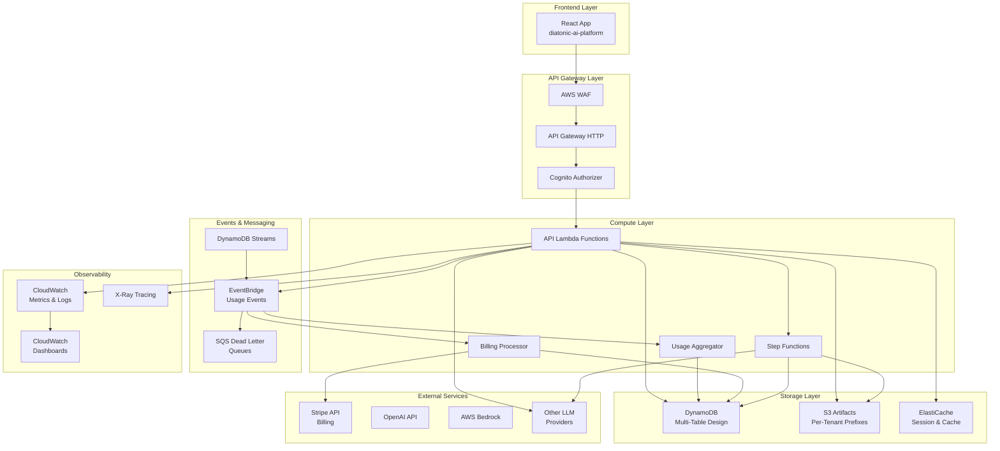

# Diatonic AI - AI Lab & Toolset Backend Architecture

## Executive Summary

This document defines the comprehensive backend architecture for the AI Lab and Toolset components of the Diatonic AI platform. The design focuses on providing users with a complete AI development, testing, and monitoring laboratory while implementing robust tenant-based usage tracking and billing capabilities.

## 🎯 System Objectives

### Primary Goals
1. **AI Development Laboratory**: Provide comprehensive tools for AI experimentation, testing, and deployment
2. **Multi-Tenant Architecture**: Strict tenant isolation with per-organization usage tracking and billing
3. **Usage Metering**: Accurate tracking of AI provider consumption (tokens, requests, compute time, storage)
4. **Billing Integration**: Stripe-based metered billing with flexible pricing plans
5. **Developer Toolset**: Linting, debugging, rule generation, monitoring, and alerts
6. **Scalable Infrastructure**: AWS serverless architecture supporting enterprise workloads

### Success Criteria
- ✅ **Tenant Isolation**: 100% data isolation between organizations
- ✅ **Usage Accuracy**: ±2% accuracy in usage metering vs provider logs
- ✅ **Billing Automation**: Automated invoice generation and payment processing
- ✅ **Performance**: <200ms API response time for 95% of requests
- ✅ **Security**: SOC 2 Type II compliance-ready security posture
- ✅ **Observability**: Full request tracing and error monitoring

## 🏗️ High-Level Architecture



## 🔐 Identity & Tenant Architecture

### Cognito User Pool Configuration
```typescript
// Custom attributes for tenant management
interface CognitoUserAttributes {
  'custom:tenant_id': string;
  'custom:role': 'platform_admin' | 'tenant_admin' | 'developer' | 'analyst' | 'observer';
  'custom:plan': 'free' | 'pro' | 'enterprise';
  'custom:features': string[]; // JSON array of enabled features
}

// JWT Claims after Pre-Token Generation Lambda
interface JWTClaims {
  sub: string; // User ID
  email: string;
  tenant_id: string;
  role: string;
  permissions: string[];
  plan_limits: {
    max_requests_per_month: number;
    max_tokens_per_month: number;
    max_storage_gb: number;
    enabled_features: string[];
  };
}
```

### Tenant Isolation Strategy
- **Path Pattern**: All APIs use `/v1/tenants/{tenantId}/...` pattern
- **Middleware Validation**: Every request validates `token.tenant_id === path.tenantId` (except platform_admin)
- **Database Scoping**: All DynamoDB items include `tenantId` in partition key
- **S3 Prefixes**: All S3 objects use `tenants/{tenantId}/...` prefix structure
- **IAM Conditions**: Fine-grained IAM policies with condition-based access control

## 🗄️ Data Architecture

### DynamoDB Table Design

#### Primary Tables

**1. Main Entity Table: `ainexus-{env}-entities`**
```typescript
interface EntityItem {
  PK: `TENANT#${string}`;              // Partition Key: TENANT#{tenantId}
  SK: `${EntityType}#${string}`;       // Sort Key: TYPE#entityId
  GSI1PK?: string;                     // Global Secondary Index 1
  GSI1SK?: string;
  GSI2PK?: string;                     // Global Secondary Index 2  
  GSI2SK?: string;
  
  // Common attributes
  tenantId: string;
  entityId: string;
  entityType: EntityType;
  name: string;
  description?: string;
  status: 'active' | 'inactive' | 'archived';
  createdAt: string;
  updatedAt: string;
  createdBy: string;
  tags: string[];
  metadata: Record<string, any>;
  
  // Type-specific attributes
  [key: string]: any;
}

type EntityType = 
  | 'PROJECT' 
  | 'AGENT' 
  | 'AGENT_VERSION'
  | 'RUN' 
  | 'EXPERIMENT' 
  | 'DATASET'
  | 'PROMPT' 
  | 'PROMPT_VERSION'
  | 'TOOL'
  | 'RULESET'
  | 'RULE_VERSION'
  | 'DEBUG_SESSION'
  | 'MONITOR_CONFIG'
  | 'USER_PROFILE';
```

**2. Usage Events Table: `ainexus-{env}-usage`**
```typescript
interface UsageEvent {
  PK: `TENANT#${string}`;              // TENANT#{tenantId}
  SK: `UE#${string}#${string}`;        // UE#{timestamp}#{uuid}
  
  tenantId: string;
  userId: string;
  projectId?: string;
  agentId?: string;
  runId?: string;
  toolId?: string;
  
  // Metering data
  meter: UsageMeter;
  quantity: number;
  costUsdEstimate?: number;
  
  // Provider context
  provider: 'openai' | 'anthropic' | 'bedrock' | 'internal';
  model?: string;
  
  // Request context
  requestId: string;
  timestamp: string;
  
  // Additional dimensions
  dimensions: {
    endpoint?: string;
    method?: string;
    status_code?: number;
    latency_ms?: number;
    error_type?: string;
  };
  
  // TTL for automatic cleanup (90 days)
  ttl: number;
}

type UsageMeter = 
  | 'requests'
  | 'tokens_in' 
  | 'tokens_out'
  | 'images_generated'
  | 'audio_seconds'
  | 'compute_seconds'
  | 'storage_mb'
  | 'egress_mb'
  | 'fine_tune_tokens'
  | 'eval_examples'
  | 'latency_ms';
```

**3. Usage Daily Aggregates: `ainexus-{env}-usage-daily`**
```typescript
interface UsageDailyAggregate {
  PK: `TENANT#${string}`;              // TENANT#{tenantId}
  SK: `DAY#${string}`;                 // DAY#{YYYY-MM-DD}
  
  tenantId: string;
  date: string; // YYYY-MM-DD
  
  // Aggregated metrics by meter
  aggregates: {
    [meter in UsageMeter]?: {
      quantity: number;
      cost_usd_estimate: number;
      unique_users: number;
      unique_projects: number;
    };
  };
  
  // Stripe sync status
  stripe_sync_status: 'pending' | 'synced' | 'error';
  stripe_sync_at?: string;
  
  createdAt: string;
  updatedAt: string;
}
```

**4. Tenant Configuration: `ainexus-{env}-tenants`**
```typescript
interface TenantConfig {
  PK: `TENANT#${string}`;              // TENANT#{tenantId}
  SK: 'CONFIG';
  
  tenantId: string;
  name: string;
  domain?: string;
  
  // Billing configuration
  plan: 'free' | 'pro' | 'enterprise';
  stripe_customer_id?: string;
  stripe_subscription_id?: string;
  
  // Plan limits
  limits: {
    max_users: number;
    max_projects: number;
    max_requests_per_month: number;
    max_tokens_per_month: number;
    max_storage_gb: number;
    enabled_features: string[];
  };
  
  // Current usage (cached)
  current_usage: {
    users: number;
    projects: number;
    storage_gb: number;
    // Monthly usage reset on billing cycle
    monthly_requests: number;
    monthly_tokens: number;
  };
  
  status: 'active' | 'suspended' | 'pending_setup';
  created_at: string;
  updated_at: string;
}
```

### S3 Bucket Structure

**Bucket: `ainexus-artifacts-{env}`**
```
ainexus-artifacts-{env}/
├── tenants/
│   └── {tenantId}/
│       ├── agents/
│       │   └── {agentId}/
│       │       ├── versions/
│       │       │   └── {version}/
│       │       │       ├── flow-graph.json
│       │       │       ├── config.json
│       │       │       └── assets/
│       │       └── exports/
│       ├── runs/
│       │   └── {runId}/
│       │       ├── inputs/
│       │       ├── outputs/
│       │       ├── logs/
│       │       └── traces/
│       ├── datasets/
│       │   └── {datasetId}/
│       │       ├── raw/
│       │       ├── processed/
│       │       └── schema.json
│       ├── experiments/
│       │   └── {experimentId}/
│       │       ├── config.json
│       │       ├── results/
│       │       └── artifacts/
│       ├── prompts/
│       │   └── {promptId}/
│       │       └── versions/
│       │           └── {version}/
│       ├── exports/
│       │   └── usage/
│       │       └── {year}/
│       │           └── {month}/
│       └── debug/
│           └── {sessionId}/
│               ├── traces/
│               └── artifacts/
└── global/
    ├── rulesets/
    │   └── templates/
    └── system/
        └── migrations/
```

## 🔌 API Design

### REST API Structure

**Base URL**: `https://api.dev.diatonic.ai/v1`

**Authentication**: Cognito JWT Bearer Token

**Core API Endpoints**:

```typescript
// Tenant Management
GET    /tenants                           // List user's tenants
GET    /tenants/{tenantId}               // Get tenant details
PUT    /tenants/{tenantId}               // Update tenant settings
POST   /tenants/{tenantId}/users/invite  // Invite user to tenant
DELETE /tenants/{tenantId}/users/{userId} // Remove user from tenant

// Projects & Workspaces
GET    /tenants/{tenantId}/projects
POST   /tenants/{tenantId}/projects
GET    /tenants/{tenantId}/projects/{projectId}
PUT    /tenants/{tenantId}/projects/{projectId}
DELETE /tenants/{tenantId}/projects/{projectId}

// AI Agents
GET    /tenants/{tenantId}/agents
POST   /tenants/{tenantId}/agents
GET    /tenants/{tenantId}/agents/{agentId}
PUT    /tenants/{tenantId}/agents/{agentId}
DELETE /tenants/{tenantId}/agents/{agentId}
GET    /tenants/{tenantId}/agents/{agentId}/versions
POST   /tenants/{tenantId}/agents/{agentId}/versions
GET    /tenants/{tenantId}/agents/{agentId}/versions/{version}
PUT    /tenants/{tenantId}/agents/{agentId}/versions/{version}

// Agent Runs & Executions
GET    /tenants/{tenantId}/runs
POST   /tenants/{tenantId}/runs           // Start new run
GET    /tenants/{tenantId}/runs/{runId}
PATCH  /tenants/{tenantId}/runs/{runId}   // Update run status
DELETE /tenants/{tenantId}/runs/{runId}
GET    /tenants/{tenantId}/runs/{runId}/logs
GET    /tenants/{tenantId}/runs/{runId}/traces

// Experiments & Evaluations
GET    /tenants/{tenantId}/experiments
POST   /tenants/{tenantId}/experiments
GET    /tenants/{tenantId}/experiments/{expId}
PUT    /tenants/{tenantId}/experiments/{expId}
POST   /tenants/{tenantId}/experiments/{expId}/start
GET    /tenants/{tenantId}/experiments/{expId}/status
GET    /tenants/{tenantId}/experiments/{expId}/results

// Datasets
GET    /tenants/{tenantId}/datasets
POST   /tenants/{tenantId}/datasets
GET    /tenants/{tenantId}/datasets/{datasetId}
PUT    /tenants/{tenantId}/datasets/{datasetId}
DELETE /tenants/{tenantId}/datasets/{datasetId}
POST   /tenants/{tenantId}/datasets/{datasetId}/upload
GET    /tenants/{tenantId}/datasets/{datasetId}/download

// Prompts & Templates
GET    /tenants/{tenantId}/prompts
POST   /tenants/{tenantId}/prompts
GET    /tenants/{tenantId}/prompts/{promptId}
PUT    /tenants/{tenantId}/prompts/{promptId}
DELETE /tenants/{tenantId}/prompts/{promptId}
GET    /tenants/{tenantId}/prompts/{promptId}/versions
POST   /tenants/{tenantId}/prompts/{promptId}/versions

// AI Development Tools
POST   /tenants/{tenantId}/lint/run       // Run linting analysis
GET    /tenants/{tenantId}/lint/{lintRunId}/results
POST   /tenants/{tenantId}/rules/generate // Generate rules from context
GET    /tenants/{tenantId}/rulesets
POST   /tenants/{tenantId}/rulesets
GET    /tenants/{tenantId}/rulesets/{rulesetId}
GET    /tenants/{tenantId}/rulesets/{rulesetId}/versions

// Monitoring & Alerts
GET    /tenants/{tenantId}/monitors
POST   /tenants/{tenantId}/monitors
GET    /tenants/{tenantId}/monitors/{monitorId}
PUT    /tenants/{tenantId}/monitors/{monitorId}
GET    /tenants/{tenantId}/alerts
POST   /tenants/{tenantId}/alerts/{alertId}/acknowledge

// Debug & Tracing
GET    /tenants/{tenantId}/debug/sessions
POST   /tenants/{tenantId}/debug/sessions
GET    /tenants/{tenantId}/debug/sessions/{sessionId}
PATCH  /tenants/{tenantId}/debug/sessions/{sessionId}
GET    /tenants/{tenantId}/debug/sessions/{sessionId}/traces

// Usage & Analytics
GET    /tenants/{tenantId}/usage/daily
GET    /tenants/{tenantId}/usage/monthly
POST   /tenants/{tenantId}/usage/events   // Bulk usage event ingestion
GET    /tenants/{tenantId}/analytics/dashboard

// Billing & Subscription
GET    /tenants/{tenantId}/billing/plan
PUT    /tenants/{tenantId}/billing/plan
GET    /tenants/{tenantId}/billing/usage
GET    /tenants/{tenantId}/billing/invoices
GET    /tenants/{tenantId}/billing/invoices/{invoiceId}

// Admin APIs (Platform Admin Only)
GET    /admin/tenants
POST   /admin/tenants
GET    /admin/tenants/{tenantId}
PUT    /admin/tenants/{tenantId}
GET    /admin/usage/export
GET    /admin/billing/reconcile
GET    /admin/system/health

// Webhooks
POST   /webhooks/stripe                   // Stripe webhook handler
```

## 💡 AI Toolset Features

### 1. AI Linting Service

**Purpose**: Analyze AI prompts, agent flows, and configurations for best practices, security issues, and optimization opportunities.

```typescript
interface LintRequest {
  targets: {
    prompts?: string[];
    agent_flows?: AgentFlowGraph[];
    configs?: Record<string, any>[];
  };
  ruleset_id?: string; // Use specific ruleset, default to tenant default
  severity_threshold?: 'info' | 'warning' | 'error';
}

interface LintResult {
  lint_run_id: string;
  status: 'running' | 'completed' | 'failed';
  summary: {
    total_findings: number;
    by_severity: { info: number; warning: number; error: number; };
    by_category: { security: number; performance: number; best_practice: number; };
  };
  findings: LintFinding[];
}

interface LintFinding {
  finding_id: string;
  severity: 'info' | 'warning' | 'error';
  category: 'security' | 'performance' | 'best_practice' | 'compliance';
  code: string; // e.g., 'PROMPT_TOO_LONG', 'MISSING_ERROR_HANDLER'
  message: string;
  target: {
    type: 'prompt' | 'flow_node' | 'config';
    id: string;
    location?: string; // e.g., "line 15, column 23"
  };
  suggestion?: string;
  documentation_url?: string;
}
```

**Built-in Lint Rules**:
- **Security**: Detect hardcoded secrets, PII in prompts, unsafe tool configurations
- **Performance**: Identify inefficient prompt patterns, circular flows, resource leaks
- **Best Practices**: Validate prompt structure, error handling, timeout configuration
- **Compliance**: Check for content policy violations, data retention compliance

### 2. Rule Generation Service

**Purpose**: Generate custom rulesets based on project context, incidents, or user requirements.

```typescript
interface RuleGenerationRequest {
  context: {
    project_description: string;
    domain: string; // e.g., 'healthcare', 'finance', 'general'
    compliance_requirements?: string[];
    recent_incidents?: IncidentContext[];
    existing_findings?: LintFinding[];
  };
  rule_types: ('security' | 'performance' | 'compliance' | 'custom')[];
  target_format: 'warp' | 'eslint' | 'custom';
}

interface GeneratedRuleset {
  ruleset_id: string;
  name: string;
  description: string;
  version: string;
  rules: GeneratedRule[];
  metadata: {
    generated_at: string;
    confidence_score: number;
    source_context: string[];
  };
}

interface GeneratedRule {
  rule_id: string;
  name: string;
  description: string;
  severity: 'info' | 'warning' | 'error';
  category: string;
  pattern: RulePattern;
  suggestion: string;
  rationale: string;
}
```

### 3. Debug & Trace Service

**Purpose**: Provide comprehensive debugging capabilities for AI agent runs, including distributed tracing, performance analysis, and error investigation.

```typescript
interface DebugSession {
  session_id: string;
  tenant_id: string;
  name: string;
  description?: string;
  
  // Associated resources
  run_ids: string[];
  agent_ids: string[];
  experiment_ids?: string[];
  
  // Tracing configuration
  trace_config: {
    enable_detailed_logging: boolean;
    capture_intermediate_outputs: boolean;
    include_provider_traces: boolean;
    sampling_rate: number; // 0.0 to 1.0
  };
  
  // Session status
  status: 'active' | 'paused' | 'completed';
  created_at: string;
  completed_at?: string;
  
  // Collected data
  traces: TraceSpan[];
  logs: DebugLog[];
  artifacts: S3Reference[];
}

interface TraceSpan {
  span_id: string;
  parent_span_id?: string;
  trace_id: string;
  operation_name: string;
  start_time: string;
  end_time?: string;
  duration_ms?: number;
  
  tags: Record<string, string>;
  attributes: {
    tenant_id: string;
    user_id: string;
    agent_id?: string;
    run_id?: string;
    provider?: string;
    model?: string;
  };
  
  events: TraceEvent[];
  status: 'ok' | 'error' | 'timeout';
  error?: {
    type: string;
    message: string;
    stack?: string;
  };
}
```

### 4. Monitoring & Alerting Service

**Purpose**: Proactive monitoring of AI operations with configurable alerts for performance, cost, security, and business metrics.

```typescript
interface MonitorConfig {
  monitor_id: string;
  tenant_id: string;
  name: string;
  description?: string;
  
  // Monitoring target
  target: {
    type: 'agent' | 'project' | 'tenant' | 'global';
    resource_ids: string[];
  };
  
  // Alert rules
  rules: MonitorRule[];
  
  // Notification settings
  notifications: {
    channels: ('email' | 'slack' | 'webhook')[];
    emails?: string[];
    slack_webhook?: string;
    webhook_url?: string;
  };
  
  status: 'enabled' | 'disabled';
  created_at: string;
}

interface MonitorRule {
  rule_id: string;
  name: string;
  metric: MonitorMetric;
  condition: {
    operator: 'gt' | 'lt' | 'eq' | 'gte' | 'lte';
    threshold: number;
    window_minutes: number;
    evaluation_frequency_minutes: number;
  };
  severity: 'info' | 'warning' | 'critical';
}

type MonitorMetric = 
  | 'avg_latency_ms'
  | 'error_rate_percent'
  | 'cost_per_hour_usd'
  | 'tokens_per_hour'
  | 'requests_per_hour'
  | 'storage_usage_gb'
  | 'concurrent_runs';
```

## 💰 Usage Metering & Billing

### Usage Event Collection

```typescript
// Usage event emitted by provider adapters
interface UsageEventPayload {
  tenant_id: string;
  user_id: string;
  project_id?: string;
  agent_id?: string;
  run_id?: string;
  tool_id?: string;
  
  // Metering data
  meter: UsageMeter;
  quantity: number;
  cost_usd_estimate?: number;
  
  // Provider context
  provider: string;
  model?: string;
  
  // Request context
  request_id: string;
  timestamp: string; // ISO 8601
  
  // Additional context
  dimensions?: Record<string, any>;
}

// Provider adapter interface
interface ProviderAdapter {
  name: string;
  
  // Execute API call and emit usage
  execute(request: ProviderRequest): Promise<ProviderResponse>;
  
  // Calculate cost estimates
  estimateCost(usage: UsageData): number;
}

// OpenAI adapter example
class OpenAIAdapter implements ProviderAdapter {
  async execute(request: OpenAIRequest): Promise<OpenAIResponse> {
    const startTime = Date.now();
    
    try {
      const response = await this.client.chat.completions.create(request);
      const endTime = Date.now();
      
      // Emit usage events
      await this.usageEmitter.emit({
        tenant_id: request.tenantId,
        user_id: request.userId,
        meter: 'tokens_in',
        quantity: response.usage.prompt_tokens,
        provider: 'openai',
        model: request.model,
        dimensions: {
          latency_ms: endTime - startTime,
          status: 'success'
        }
      });
      
      await this.usageEmitter.emit({
        tenant_id: request.tenantId,
        user_id: request.userId,
        meter: 'tokens_out',
        quantity: response.usage.completion_tokens,
        cost_usd_estimate: this.estimateCost({
          model: request.model,
          prompt_tokens: response.usage.prompt_tokens,
          completion_tokens: response.usage.completion_tokens
        })
      });
      
      return response;
    } catch (error) {
      // Emit error usage event
      await this.usageEmitter.emit({
        tenant_id: request.tenantId,
        user_id: request.userId,
        meter: 'requests',
        quantity: 1,
        dimensions: {
          status: 'error',
          error_type: error.type
        }
      });
      throw error;
    }
  }
}
```

### Stripe Integration

```typescript
interface StripeIntegration {
  // Sync daily usage to Stripe
  syncUsageToStripe(tenantId: string, date: string): Promise<void>;
  
  // Handle webhook events
  handleWebhook(event: Stripe.Event): Promise<void>;
  
  // Manage subscriptions
  createSubscription(tenantId: string, priceId: string): Promise<Stripe.Subscription>;
  updateSubscription(subscriptionId: string, items: Stripe.SubscriptionItem[]): Promise<Stripe.Subscription>;
}

// Billing plans configuration
interface BillingPlans {
  free: {
    base_price_usd: 0;
    limits: {
      max_requests_per_month: 1000;
      max_tokens_per_month: 100000;
      max_storage_gb: 1;
    };
    metered_rates: {}; // No metered billing for free tier
  };
  
  pro: {
    base_price_usd: 29;
    limits: {
      max_requests_per_month: 50000;
      max_tokens_per_month: 2000000;
      max_storage_gb: 10;
    };
    metered_rates: {
      tokens_in: 0.000001; // $0.000001 per input token
      tokens_out: 0.000002; // $0.000002 per output token
      storage_gb: 0.10; // $0.10 per GB per month
      egress_gb: 0.05; // $0.05 per GB egress
    };
  };
  
  enterprise: {
    base_price_usd: 299;
    limits: {
      max_requests_per_month: -1; // unlimited
      max_tokens_per_month: -1;
      max_storage_gb: 100;
    };
    metered_rates: {
      tokens_in: 0.0000005;
      tokens_out: 0.000001;
      storage_gb: 0.05;
      egress_gb: 0.02;
    };
  };
}
```

## 🚀 Deployment & Infrastructure

### AWS CDK Stacks

```typescript
// Core infrastructure stack
export class AINexusCoreStack extends Stack {
  constructor(scope: Construct, id: string, props: StackProps) {
    super(scope, id, props);
    
    // Cognito User Pool with custom attributes
    const userPool = new UserPool(this, 'UserPool', {
      customAttributes: {
        tenant_id: new StringAttribute({ mutable: false }),
        role: new StringAttribute({ mutable: true }),
        plan: new StringAttribute({ mutable: true }),
        features: new StringAttribute({ mutable: true })
      },
      triggers: {
        preTokenGeneration: this.createPreTokenLambda()
      }
    });
    
    // API Gateway with Cognito authorizer
    const api = new RestApi(this, 'API', {
      defaultCorsPreflightOptions: {
        allowOrigins: Cors.ALL_ORIGINS,
        allowMethods: Cors.ALL_METHODS,
        allowHeaders: ['Content-Type', 'Authorization']
      }
    });
    
    const authorizer = new CognitoUserPoolsAuthorizer(this, 'Authorizer', {
      cognitoUserPools: [userPool]
    });
    
    api.root.addProxy({
      defaultIntegration: new LambdaIntegration(this.createApiLambda()),
      anyMethod: true,
      defaultMethodOptions: {
        authorizer,
        authorizationType: AuthorizationType.COGNITO
      }
    });
  }
}

// Data layer stack
export class AINexusDataStack extends Stack {
  constructor(scope: Construct, id: string, props: StackProps) {
    super(scope, id, props);
    
    // Main entities table
    const entitiesTable = new Table(this, 'EntitiesTable', {
      billingMode: BillingMode.PAY_PER_REQUEST,
      partitionKey: { name: 'PK', type: AttributeType.STRING },
      sortKey: { name: 'SK', type: AttributeType.STRING },
      pointInTimeRecovery: true,
      encryption: TableEncryption.AWS_MANAGED,
      stream: StreamViewType.NEW_AND_OLD_IMAGES
    });
    
    // Add GSIs for efficient queries
    entitiesTable.addGlobalSecondaryIndex({
      indexName: 'GSI1',
      partitionKey: { name: 'GSI1PK', type: AttributeType.STRING },
      sortKey: { name: 'GSI1SK', type: AttributeType.STRING }
    });
    
    // Usage events table with TTL
    const usageTable = new Table(this, 'UsageTable', {
      billingMode: BillingMode.PAY_PER_REQUEST,
      partitionKey: { name: 'PK', type: AttributeType.STRING },
      sortKey: { name: 'SK', type: AttributeType.STRING },
      timeToLiveAttribute: 'ttl',
      stream: StreamViewType.NEW_IMAGES_ONLY
    });
    
    // Usage daily aggregates table
    const usageDailyTable = new Table(this, 'UsageDailyTable', {
      billingMode: BillingMode.PAY_PER_REQUEST,
      partitionKey: { name: 'PK', type: AttributeType.STRING },
      sortKey: { name: 'SK', type: AttributeType.STRING }
    });
    
    // Tenant configuration table
    const tenantsTable = new Table(this, 'TenantsTable', {
      billingMode: BillingMode.PAY_PER_REQUEST,
      partitionKey: { name: 'PK', type: AttributeType.STRING },
      sortKey: { name: 'SK', type: AttributeType.STRING }
    });
  }
}

// S3 storage stack
export class AINexusStorageStack extends Stack {
  constructor(scope: Construct, id: string, props: StackProps) {
    super(scope, id, props);
    
    // Artifacts bucket with tenant-based prefixes
    const artifactsBucket = new Bucket(this, 'ArtifactsBucket', {
      encryption: BucketEncryption.S3_MANAGED,
      blockPublicAccess: BlockPublicAccess.BLOCK_ALL,
      versioned: true,
      lifecycleRules: [
        {
          id: 'LogsTransition',
          enabled: true,
          prefix: 'tenants/*/runs/*/logs/',
          transitions: [
            {
              storageClass: StorageClass.STANDARD_IA,
              transitionAfter: Duration.days(30)
            },
            {
              storageClass: StorageClass.GLACIER,
              transitionAfter: Duration.days(90)
            }
          ]
        }
      ]
    });
  }
}
```

### Environment Configuration

```typescript
// Environment-specific configuration
interface EnvironmentConfig {
  readonly environment: 'dev' | 'staging' | 'prod';
  readonly region: string;
  readonly domainName: string;
  readonly cognitoUserPoolId: string;
  
  // Feature flags
  readonly features: {
    enableDetailedLogging: boolean;
    enableXRayTracing: boolean;
    enableUsageAggregation: boolean;
    enableStripeIntegration: boolean;
  };
  
  // Resource limits
  readonly limits: {
    lambdaTimeout: Duration;
    lambdaMemorySize: number;
    apiRateLimit: number;
    maxConcurrentRuns: number;
  };
  
  // External service configuration
  readonly externalServices: {
    stripeSecretName: string;
    openaiSecretName: string;
    slackWebhookSecretName?: string;
  };
}

const configs: Record<string, EnvironmentConfig> = {
  dev: {
    environment: 'dev',
    region: 'us-east-2',
    domainName: 'dev.diatonic.ai',
    cognitoUserPoolId: 'us-east-2_xkNeOGMu1',
    features: {
      enableDetailedLogging: true,
      enableXRayTracing: true,
      enableUsageAggregation: true,
      enableStripeIntegration: false // Use test mode
    },
    limits: {
      lambdaTimeout: Duration.seconds(30),
      lambdaMemorySize: 256,
      apiRateLimit: 1000,
      maxConcurrentRuns: 10
    },
    externalServices: {
      stripeSecretName: 'ainexus/dev/stripe/secret',
      openaiSecretName: 'ainexus/dev/openai/key'
    }
  },
  // ... staging and prod configs
};
```

## 📊 Observability & Monitoring

### CloudWatch Dashboards

```typescript
// Operational dashboard
const operationalDashboard = new Dashboard(this, 'OperationalDashboard', {
  dashboardName: `ai-nexus-${props.environment}-operations`
});

operationalDashboard.addWidgets(
  // API metrics
  new GraphWidget({
    title: 'API Request Rate',
    left: [
      new Metric({
        namespace: 'AWS/ApiGateway',
        metricName: 'Count',
        dimensionsMap: { ApiName: 'ai-nexus-api' },
        statistic: 'Sum'
      })
    ]
  }),
  
  // Lambda metrics
  new GraphWidget({
    title: 'Lambda Error Rate',
    left: [
      new Metric({
        namespace: 'AWS/Lambda',
        metricName: 'Errors',
        statistic: 'Sum'
      })
    ]
  }),
  
  // Usage metrics
  new GraphWidget({
    title: 'Token Usage by Tenant',
    left: [
      new Metric({
        namespace: 'AI-Nexus/Usage',
        metricName: 'TokensConsumed',
        dimensionsMap: { Provider: 'openai' },
        statistic: 'Sum'
      })
    ]
  }),
  
  // Cost metrics
  new GraphWidget({
    title: 'Estimated Costs',
    left: [
      new Metric({
        namespace: 'AI-Nexus/Billing',
        metricName: 'EstimatedCostUSD',
        statistic: 'Sum'
      })
    ]
  })
);

// Business metrics dashboard
const businessDashboard = new Dashboard(this, 'BusinessDashboard', {
  dashboardName: `ai-nexus-${props.environment}-business`
});

businessDashboard.addWidgets(
  new SingleValueWidget({
    title: 'Active Tenants',
    metrics: [
      new Metric({
        namespace: 'AI-Nexus/Business',
        metricName: 'ActiveTenants',
        statistic: 'Maximum'
      })
    ]
  }),
  
  new SingleValueWidget({
    title: 'Monthly Recurring Revenue',
    metrics: [
      new Metric({
        namespace: 'AI-Nexus/Business',
        metricName: 'MRR',
        statistic: 'Maximum'
      })
    ]
  }),
  
  new GraphWidget({
    title: 'Usage by Plan',
    left: [
      new Metric({
        namespace: 'AI-Nexus/Usage',
        metricName: 'TokensConsumed',
        dimensionsMap: { Plan: 'free' },
        statistic: 'Sum',
        label: 'Free Plan'
      }),
      new Metric({
        namespace: 'AI-Nexus/Usage',
        metricName: 'TokensConsumed',
        dimensionsMap: { Plan: 'pro' },
        statistic: 'Sum',
        label: 'Pro Plan'
      })
    ]
  })
);
```

### Alarms & Alerts

```typescript
// Critical system alarms
const criticalAlarms = [
  new Alarm(this, 'HighErrorRate', {
    metric: new Metric({
      namespace: 'AWS/Lambda',
      metricName: 'Errors',
      statistic: 'Sum',
      period: Duration.minutes(5)
    }),
    threshold: 10,
    evaluationPeriods: 2,
    alarmDescription: 'High Lambda error rate detected'
  }),
  
  new Alarm(this, 'HighLatency', {
    metric: new Metric({
      namespace: 'AWS/ApiGateway',
      metricName: 'Latency',
      statistic: 'Average',
      period: Duration.minutes(5)
    }),
    threshold: 5000, // 5 seconds
    evaluationPeriods: 3,
    alarmDescription: 'High API latency detected'
  }),
  
  new Alarm(this, 'BillingWebhookFailures', {
    metric: new Metric({
      namespace: 'AI-Nexus/Billing',
      metricName: 'WebhookFailures',
      statistic: 'Sum',
      period: Duration.minutes(5)
    }),
    threshold: 1,
    evaluationPeriods: 1,
    alarmDescription: 'Stripe webhook processing failed'
  })
];

// SNS topic for alerts
const alertsTopic = new Topic(this, 'AlertsTopic', {
  displayName: 'AI Nexus Critical Alerts'
});

alertsTopic.addSubscription(
  new EmailSubscription('alerts@diatonic.ai')
);

// Connect alarms to SNS
criticalAlarms.forEach(alarm => {
  alarm.addAlarmAction(new SnsAction(alertsTopic));
});
```

## 🔒 Security & Compliance

### IAM Policies with Tenant Isolation

```json
{
  "Version": "2012-10-17",
  "Statement": [
    {
      "Effect": "Allow",
      "Action": [
        "dynamodb:Query",
        "dynamodb:GetItem",
        "dynamodb:PutItem",
        "dynamodb:UpdateItem",
        "dynamodb:DeleteItem"
      ],
      "Resource": [
        "arn:aws:dynamodb:*:*:table/ainexus-*-entities",
        "arn:aws:dynamodb:*:*:table/ainexus-*-entities/index/*"
      ],
      "Condition": {
        "ForAllValues:StringEquals": {
          "dynamodb:LeadingKeys": [
            "TENANT#${cognito:custom:tenant_id}"
          ]
        }
      }
    },
    {
      "Effect": "Allow",
      "Action": [
        "s3:GetObject",
        "s3:PutObject",
        "s3:DeleteObject"
      ],
      "Resource": [
        "arn:aws:s3:::ainexus-artifacts-*/tenants/${cognito:custom:tenant_id}/*"
      ]
    }
  ]
}
```

### Data Encryption

- **At Rest**: All DynamoDB tables use AWS managed encryption
- **In Transit**: TLS 1.2+ for all API communications
- **S3 Objects**: Server-side encryption with AWS managed keys
- **Sensitive Data**: Application-level encryption for PII using AWS KMS

### Audit Logging

```typescript
interface AuditEvent {
  event_id: string;
  tenant_id: string;
  user_id: string;
  action: string;
  resource_type: string;
  resource_id: string;
  timestamp: string;
  source_ip: string;
  user_agent: string;
  result: 'success' | 'failure';
  details: Record<string, any>;
}

// Audit middleware
const auditMiddleware = (event: APIGatewayProxyEvent, context: Context) => {
  const auditEvent: AuditEvent = {
    event_id: context.awsRequestId,
    tenant_id: event.requestContext.authorizer?.claims['custom:tenant_id'],
    user_id: event.requestContext.authorizer?.claims['sub'],
    action: `${event.httpMethod} ${event.resource}`,
    resource_type: extractResourceType(event.resource),
    resource_id: extractResourceId(event.pathParameters),
    timestamp: new Date().toISOString(),
    source_ip: event.requestContext.identity.sourceIp,
    user_agent: event.headers['User-Agent'],
    result: 'success', // Updated after operation
    details: {}
  };
  
  // Log to CloudWatch and/or dedicated audit table
  await auditLogger.log(auditEvent);
};
```

## 📈 Performance & Scalability

### Lambda Optimization

```typescript
// Optimized Lambda handler with connection pooling
export const handler = async (event: APIGatewayProxyEvent): Promise<APIGatewayProxyResult> => {
  // Initialize connections outside handler for reuse
  const dynamoClient = DynamoDBClientSingleton.getInstance();
  const s3Client = S3ClientSingleton.getInstance();
  
  // Request correlation ID
  const requestId = event.requestContext.requestId;
  
  // Structured logging
  const logger = createLogger({
    requestId,
    tenantId: extractTenantId(event),
    userId: extractUserId(event)
  });
  
  try {
    // Route request to appropriate handler
    const router = new APIRouter({
      dynamoClient,
      s3Client,
      logger
    });
    
    return await router.handle(event);
  } catch (error) {
    logger.error('Request failed', { error });
    
    return {
      statusCode: 500,
      headers: corsHeaders,
      body: JSON.stringify({
        error: 'Internal server error',
        requestId
      })
    };
  }
};

// Connection pooling singleton
class DynamoDBClientSingleton {
  private static instance: DynamoDBClient;
  
  static getInstance(): DynamoDBClient {
    if (!this.instance) {
      this.instance = new DynamoDBClient({
        region: process.env.AWS_REGION,
        maxAttempts: 3,
        retryMode: 'adaptive'
      });
    }
    return this.instance;
  }
}
```

### Caching Strategy

```typescript
// In-memory caching for frequently accessed data
class TenantConfigCache {
  private cache = new Map<string, { config: TenantConfig; expiry: number }>();
  private readonly TTL_MS = 5 * 60 * 1000; // 5 minutes
  
  async get(tenantId: string): Promise<TenantConfig | null> {
    const cached = this.cache.get(tenantId);
    
    if (cached && cached.expiry > Date.now()) {
      return cached.config;
    }
    
    // Cache miss - fetch from DynamoDB
    const config = await this.fetchFromDatabase(tenantId);
    
    if (config) {
      this.cache.set(tenantId, {
        config,
        expiry: Date.now() + this.TTL_MS
      });
    }
    
    return config;
  }
  
  invalidate(tenantId: string): void {
    this.cache.delete(tenantId);
  }
}

// ElastiCache for session data and frequently accessed entities
const redisClient = new Redis({
  host: process.env.REDIS_CLUSTER_ENDPOINT,
  port: 6379,
  keyPrefix: 'ainexus:',
  retryDelayOnFailover: 100,
  maxRetriesPerRequest: 3
});

class SessionCache {
  async getSession(sessionId: string): Promise<SessionData | null> {
    const cached = await redisClient.get(`session:${sessionId}`);
    return cached ? JSON.parse(cached) : null;
  }
  
  async setSession(sessionId: string, data: SessionData, ttlSeconds: number = 3600): Promise<void> {
    await redisClient.setex(`session:${sessionId}`, ttlSeconds, JSON.stringify(data));
  }
}
```

## 🧪 Testing Strategy

### Unit Testing

```typescript
// Example unit test for usage metering
describe('UsageMeter', () => {
  let usageMeter: UsageMeter;
  let mockEventBridge: jest.Mocked<EventBridge>;
  
  beforeEach(() => {
    mockEventBridge = createMockEventBridge();
    usageMeter = new UsageMeter(mockEventBridge);
  });
  
  it('should emit usage event with correct structure', async () => {
    const event: UsageEventPayload = {
      tenant_id: 'tenant-123',
      user_id: 'user-456',
      meter: 'tokens_in',
      quantity: 150,
      provider: 'openai',
      model: 'gpt-4',
      request_id: 'req-789',
      timestamp: '2025-01-07T20:23:00Z'
    };
    
    await usageMeter.emit(event);
    
    expect(mockEventBridge.putEvents).toHaveBeenCalledWith({
      Entries: [
        expect.objectContaining({
          Source: 'ai-nexus.usage',
          DetailType: 'Usage Event',
          Detail: JSON.stringify(event)
        })
      ]
    });
  });
  
  it('should handle usage emission failures gracefully', async () => {
    mockEventBridge.putEvents.mockRejectedValue(new Error('EventBridge error'));
    
    const event: UsageEventPayload = {
      tenant_id: 'tenant-123',
      user_id: 'user-456',
      meter: 'requests',
      quantity: 1,
      provider: 'openai',
      request_id: 'req-789',
      timestamp: '2025-01-07T20:23:00Z'
    };
    
    // Should not throw, but should log error
    await expect(usageMeter.emit(event)).resolves.toBeUndefined();
  });
});
```

### Integration Testing

```typescript
// Integration test for API endpoints
describe('Agents API Integration', () => {
  let testClient: TestAPIClient;
  let testTenant: TestTenant;
  
  beforeAll(async () => {
    testClient = new TestAPIClient(process.env.TEST_API_ENDPOINT);
    testTenant = await createTestTenant();
  });
  
  afterAll(async () => {
    await cleanupTestTenant(testTenant.id);
  });
  
  it('should create agent with proper tenant isolation', async () => {
    const agentData = {
      name: 'Test Agent',
      description: 'Test agent for integration testing',
      type: 'conversational'
    };
    
    const response = await testClient.post(
      `/v1/tenants/${testTenant.id}/agents`,
      agentData,
      { authorization: testTenant.adminToken }
    );
    
    expect(response.status).toBe(201);
    expect(response.data.tenant_id).toBe(testTenant.id);
    
    // Verify tenant isolation - other tenant should not see this agent
    const otherTenantResponse = await testClient.get(
      `/v1/tenants/${testTenant.id}/agents`,
      { authorization: 'other-tenant-token' }
    );
    
    expect(otherTenantResponse.status).toBe(403);
  });
  
  it('should track usage for agent operations', async () => {
    const agent = await createTestAgent(testTenant.id);
    
    // Execute agent run
    const runResponse = await testClient.post(
      `/v1/tenants/${testTenant.id}/runs`,
      {
        agent_id: agent.id,
        inputs: { message: 'Hello, world!' }
      },
      { authorization: testTenant.adminToken }
    );
    
    expect(runResponse.status).toBe(201);
    
    // Wait for usage events to be processed
    await new Promise(resolve => setTimeout(resolve, 2000));
    
    // Check usage was recorded
    const usageResponse = await testClient.get(
      `/v1/tenants/${testTenant.id}/usage/daily`,
      { authorization: testTenant.adminToken }
    );
    
    expect(usageResponse.data.aggregates.requests.quantity).toBeGreaterThan(0);
  });
});
```

### Load Testing

```typescript
// Load test configuration using k6
export const options = {
  stages: [
    { duration: '2m', target: 100 }, // Ramp up
    { duration: '5m', target: 100 }, // Sustained load
    { duration: '2m', target: 200 }, // Peak load
    { duration: '5m', target: 200 }, // Sustained peak
    { duration: '2m', target: 0 },   // Ramp down
  ],
  thresholds: {
    http_req_duration: ['p(95)<500'], // 95% of requests under 500ms
    http_req_failed: ['rate<0.1'],    // Error rate under 10%
  },
};

export default function () {
  const baseUrl = __ENV.API_BASE_URL;
  const token = __ENV.TEST_TOKEN;
  const tenantId = __ENV.TEST_TENANT_ID;
  
  // Test agent listing
  const agentsResponse = http.get(
    `${baseUrl}/v1/tenants/${tenantId}/agents`,
    {
      headers: { Authorization: `Bearer ${token}` }
    }
  );
  
  check(agentsResponse, {
    'status is 200': (r) => r.status === 200,
    'response time < 500ms': (r) => r.timings.duration < 500,
  });
  
  // Test agent run creation
  const runPayload = JSON.stringify({
    agent_id: 'test-agent-123',
    inputs: { message: `Test message ${Math.random()}` }
  });
  
  const runResponse = http.post(
    `${baseUrl}/v1/tenants/${tenantId}/runs`,
    runPayload,
    {
      headers: {
        'Content-Type': 'application/json',
        Authorization: `Bearer ${token}`
      }
    }
  );
  
  check(runResponse, {
    'run creation status is 201': (r) => r.status === 201,
    'run creation time < 1s': (r) => r.timings.duration < 1000,
  });
  
  sleep(1); // 1 second between iterations
}
```

## 📚 Implementation Roadmap

### Phase 1: Foundation (Weeks 1-4)
- ✅ AWS CDK infrastructure setup
- ✅ Cognito user pool with custom attributes
- ✅ API Gateway with authorization
- ✅ Basic Lambda handlers with TypeScript
- ✅ DynamoDB table structure
- ✅ S3 bucket configuration
- ✅ Basic tenant management APIs
- ✅ User authentication and authorization
- ✅ Local development environment with LocalStack

### Phase 2: Core Features (Weeks 5-8)
- ✅ Agent management APIs (CRUD)
- ✅ Agent version control
- ✅ Run execution and tracking
- ✅ Basic usage event collection
- ✅ Project and dataset management
- ✅ Prompt management and versioning
- ✅ Provider adapter pattern implementation
- ✅ OpenAI and Bedrock adapters

### Phase 3: Usage & Billing (Weeks 9-12)
- ✅ Comprehensive usage metering
- ✅ EventBridge event processing
- ✅ Daily usage aggregation
- ✅ Stripe integration
- ✅ Billing plan enforcement
- ✅ Invoice generation and delivery
- ✅ Usage analytics and reporting
- ✅ Cost estimation and optimization

### Phase 4: AI Toolset (Weeks 13-16)
- ✅ AI Linting Service
- ✅ Rule Generation Service
- ✅ Debug and Tracing Service
- ✅ Monitoring and Alerting
- ✅ Experiment orchestration with Step Functions
- ✅ Advanced analytics and insights
- ✅ Performance optimization tools

### Phase 5: Enterprise Features (Weeks 17-20)
- ✅ Advanced security controls
- ✅ Compliance features (SOC 2, HIPAA readiness)
- ✅ Multi-region deployment
- ✅ Advanced observability
- ✅ White-label capabilities
- ✅ Enterprise SSO integration
- ✅ Advanced billing features (custom contracts)

### Phase 6: Scale & Polish (Weeks 21-24)
- ✅ Performance optimization
- ✅ Cost optimization
- ✅ Advanced caching strategies
- ✅ Load balancing and auto-scaling
- ✅ Disaster recovery procedures
- ✅ Documentation and training materials
- ✅ Launch preparation and go-to-market

## 💾 Data Migration Strategy

### Migration Scripts
```typescript
interface MigrationScript {
  version: string;
  name: string;
  description: string;
  execute(): Promise<void>;
  rollback?(): Promise<void>;
}

class InitialTenantSetup implements MigrationScript {
  version = '001';
  name = 'initial-tenant-setup';
  description = 'Create default tenant and admin users';
  
  async execute(): Promise<void> {
    // Create system tenant for platform administration
    await this.createTenant({
      tenantId: 'system',
      name: 'System Administration',
      plan: 'enterprise',
      limits: {
        max_users: -1,
        max_projects: -1,
        max_requests_per_month: -1,
        max_tokens_per_month: -1,
        max_storage_gb: 1000,
        enabled_features: ['all']
      }
    });
    
    // Create demo tenant for testing
    await this.createTenant({
      tenantId: 'demo',
      name: 'Demo Organization',
      plan: 'pro',
      limits: {
        max_users: 10,
        max_projects: 50,
        max_requests_per_month: 50000,
        max_tokens_per_month: 2000000,
        max_storage_gb: 10,
        enabled_features: ['agents', 'experiments', 'monitoring', 'linting']
      }
    });
    
    // Create sample data
    await this.createSampleAgents();
    await this.createSamplePrompts();
    await this.createSampleRulesets();
  }
  
  private async createTenant(config: TenantConfig): Promise<void> {
    const item = {
      PK: `TENANT#${config.tenantId}`,
      SK: 'CONFIG',
      ...config,
      created_at: new Date().toISOString(),
      updated_at: new Date().toISOString()
    };
    
    await dynamoClient.putItem({
      TableName: process.env.TENANTS_TABLE_NAME,
      Item: marshall(item),
      ConditionExpression: 'attribute_not_exists(PK)'
    });
  }
}

// Migration runner
class MigrationRunner {
  private migrations: MigrationScript[] = [
    new InitialTenantSetup(),
    // Add more migrations as needed
  ];
  
  async runMigrations(): Promise<void> {
    for (const migration of this.migrations) {
      const hasRun = await this.checkMigrationStatus(migration.version);
      
      if (!hasRun) {
        console.log(`Running migration ${migration.version}: ${migration.name}`);
        
        try {
          await migration.execute();
          await this.recordMigration(migration);
          console.log(`✅ Migration ${migration.version} completed`);
        } catch (error) {
          console.error(`❌ Migration ${migration.version} failed:`, error);
          
          if (migration.rollback) {
            console.log(`Rolling back migration ${migration.version}`);
            await migration.rollback();
          }
          
          throw error;
        }
      } else {
        console.log(`⏭️  Migration ${migration.version} already applied`);
      }
    }
  }
}
```

## 🎉 Conclusion

This comprehensive AI Lab & Toolset Backend Architecture provides:

1. **🏢 Multi-Tenant Foundation**: Secure, isolated environments for organizations
2. **💰 Metered Billing**: Accurate usage tracking and Stripe integration
3. **🤖 AI Development Tools**: Comprehensive toolset for AI development, testing, and monitoring
4. **📊 Rich Analytics**: Deep insights into usage, performance, and costs
5. **🔒 Enterprise Security**: SOC 2 compliance-ready security controls
6. **📈 Scalable Architecture**: AWS serverless foundation that scales with demand
7. **🔧 Developer Experience**: Rich APIs, comprehensive documentation, and development tools
8. **🚀 Production Ready**: Observability, monitoring, alerting, and operational procedures

The architecture is designed to support the Diatonic AI platform's growth from MVP to enterprise scale while maintaining security, performance, and cost-effectiveness.

**Next Steps**: Begin implementation with Phase 1 infrastructure setup, following the detailed todos and milestones outlined in this document.
