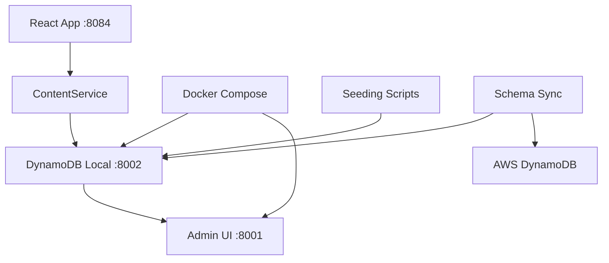

# DynamoDB Integration & Cloud Sync Guide

A complete guide for managing DynamoDB schema, data synchronization, and cloud integration in the AI Nexus Workbench project.

## 🎯 Overview

Your setup now includes:
- ✅ **Local DynamoDB**: Running on port 8002 with seeded content
- ✅ **Schema Management**: Terraform-based infrastructure as code
- ✅ **Cloud Sync**: Bi-directional synchronization between local and AWS
- ✅ **Content Management**: Rich CMS data with SEO optimization
- ✅ **Development Workflow**: Integrated npm scripts for easy management

## 🚀 Quick Start

### 1. **Start Development Environment**
```bash
# Start everything (DynamoDB + Dev Server)
npm run dev

# Or start services individually
npm run dynamodb:start    # Start local DynamoDB
npm run dev:direct        # Start dev server only
```

### 2. **Verify Setup**
```bash
# Check comprehensive status
npm run dynamodb:schema-status

# View data in admin UI
npm run dynamodb:admin    # Opens http://localhost:8001
```

### 3. **Sync with Cloud (if needed)**
```bash
# Pull schema and data from AWS
npm run dynamodb:sync-from-cloud

# Deploy local schema to AWS
npm run dynamodb:deploy-to-cloud
```

## 📊 Available Commands

### **Local Development**
```bash
npm run dynamodb:start         # Start DynamoDB Local + Admin UI
npm run dynamodb:stop          # Stop DynamoDB containers
npm run dynamodb:status        # Check if running
npm run dynamodb:admin         # Open admin UI
npm run dynamodb:logs          # View container logs
npm run dynamodb:restart       # Restart containers
```

### **Data Management**
```bash
npm run dynamodb:setup         # Create tables + seed data
npm run dynamodb:reset         # Delete all data + recreate tables
npm run db:migrate              # Run comprehensive seeding
```

### **Cloud Integration**
```bash
npm run dynamodb:schema-status      # Show local vs cloud status
npm run dynamodb:sync-from-cloud    # Pull schema + data from AWS
npm run dynamodb:deploy-to-cloud    # Deploy to AWS via Terraform
npm run dynamodb:validate           # Check schema consistency
npm run dynamodb:fix-config         # Fix configuration issues
```

## 🏗️ Architecture Overview

### **Local Development Stack**


### **Data Flow**
1. **Development**: React app → ContentService → Local DynamoDB
2. **Production**: React app → ContentService → AWS DynamoDB  
3. **Sync**: Local DynamoDB ↔ AWS DynamoDB (bi-directional)

## 📋 Tables & Schema

### **Content Management Tables**
- **`content-pages`**: Landing page content and metadata
- **`content-features`**: Service features with benefits and icons
- **`content-testimonials`**: Customer testimonials and ratings
- **`content-seo`**: SEO metadata, Open Graph, Twitter cards
- **`content-feature-details`**: Detailed feature documentation

### **Schema Consistency**
- **Local Format**: `ai-nexus-workbench-development-{table}`
- **Cloud Format**: `ai-nexus-workbench-{environment}-{table}`
- **Auto Conversion**: Schema sync handles name mapping automatically

## 🔄 Development Workflows

### **Daily Development**
```bash
# 1. Start development environment
npm run dev

# 2. Make changes to React components
# 3. Test with real DynamoDB data
# 4. View changes at http://localhost:808X
```

### **Content Updates**
```bash
# 1. Update content via admin UI
npm run dynamodb:admin

# 2. Or reseed with new data
npm run db:migrate

# 3. Verify changes in app
npm run dev
```

### **Schema Changes**
```bash
# 1. Update Terraform files in infrastructure/
# 2. Test locally first
npm run dynamodb:validate

# 3. Deploy to AWS
npm run dynamodb:deploy-to-cloud
```

### **Cloud Synchronization**
```bash
# Pull latest from production
npm run dynamodb:sync-from-cloud

# Work locally, then push changes
npm run dynamodb:deploy-to-cloud
```

## 📱 Content Service Integration

### **React Components**
Your React components use the ContentService which automatically:
- ✅ **Connects to local DynamoDB** during development
- ✅ **Connects to AWS DynamoDB** in production  
- ✅ **Provides fallback content** when offline
- ✅ **Handles errors gracefully** with proper fallback

### **Example Usage**
```typescript
import { contentService } from '@/lib/content-service';

// Fetch page content
const page = await contentService.getServicePageContent('toolset');
const features = await contentService.getServiceFeatures('toolset');  
const seo = await contentService.getSEOMetadata('toolset');
```

### **Dynamic Loading**
Components automatically fetch fresh data from DynamoDB, with intelligent caching and error handling built-in.

## 🛠️ Configuration Details

### **Endpoints**
- **Local DynamoDB**: `http://localhost:8002`
- **Admin UI**: `http://localhost:8001`
- **Dev Server**: `http://localhost:808X` (auto-finds available port)

### **Environment Variables**
```bash
# Required for AWS connectivity
VITE_AWS_REGION=us-east-2
NODE_ENV=development|production

# Optional AWS credentials (for cloud sync)
AWS_PROFILE=default
AWS_ACCESS_KEY_ID=your-key
AWS_SECRET_ACCESS_KEY=your-secret
```

### **Auto-Configuration**
The system automatically:
- ✅ **Detects environment** (dev/prod) and uses appropriate endpoints
- ✅ **Handles credentials** via AWS SDK credential chain
- ✅ **Falls back gracefully** when services unavailable
- ✅ **Fixes common issues** via `dynamodb:fix-config` command

## 🔍 Troubleshooting

### **Common Issues**

#### **"No tables found"**
```bash
# Recreate and seed tables
npm run dynamodb:reset
npm run dynamodb:setup
```

#### **"Port 8002 not available"**
```bash
# Check what's using the port
lsof -i :8002

# Restart containers
npm run dynamodb:restart
```

#### **"AWS authentication failed"**
```bash
# Configure AWS CLI
aws configure

# Or use environment variables
export AWS_PROFILE=your-profile
```

#### **"Schema mismatch errors"**
```bash
# Fix configuration issues
npm run dynamodb:fix-config

# Validate consistency
npm run dynamodb:validate
```

### **Health Checks**
```bash
# Complete system status
npm run dynamodb:schema-status

# Test local connectivity
curl http://localhost:8002

# Test table access
aws dynamodb list-tables --endpoint-url http://localhost:8002
```

### **Reset Everything**
```bash
# Nuclear option - reset everything
npm run dynamodb:stop
docker system prune -f
npm run dynamodb:start
npm run dynamodb:setup
npm run dev
```

## 🚀 Deployment Pipeline

### **Development → Staging**
1. **Test locally**: `npm run dynamodb:validate`
2. **Deploy schema**: `npm run dynamodb:deploy-to-cloud`
3. **Sync data**: Manual verification via AWS Console
4. **Deploy app**: Via your CI/CD pipeline

### **Schema Evolution**
1. **Update Terraform**: Modify `infrastructure/*.tf` files
2. **Plan deployment**: Terraform automatically plans changes
3. **Review changes**: Careful review before applying
4. **Deploy incrementally**: Use Terraform state management

### **Data Migration**
1. **Backup existing**: Always backup before major changes
2. **Test migration**: Run on staging environment first
3. **Gradual rollout**: Migrate in batches if possible
4. **Monitor closely**: Watch for errors during migration

## 📈 Performance Optimization

### **Local Development**
- **Read Replicas**: Local DynamoDB handles high read loads efficiently
- **Connection Pooling**: ContentService reuses connections
- **Caching**: Intelligent fallback caching built-in
- **Batch Operations**: Use when updating multiple items

### **Production Optimization**
- **Provisioned Throughput**: Configured via Terraform
- **Global Secondary Indexes**: Optimized for query patterns
- **Point-in-Time Recovery**: Enabled for production tables
- **Encryption**: Server-side encryption at rest

## 🔐 Security Considerations

### **Development**
- ✅ Local DynamoDB uses test credentials only
- ✅ No sensitive data in version control
- ✅ Environment variables for configuration
- ✅ Proper error handling prevents data leaks

### **Production**
- ✅ IAM roles with least privilege access
- ✅ VPC endpoints for secure communication
- ✅ Server-side encryption for data at rest
- ✅ Audit logging for all operations

## 📚 Additional Resources

### **AWS Documentation**
- [DynamoDB Developer Guide](https://docs.aws.amazon.com/dynamodb/latest/developerguide/)
- [AWS CLI DynamoDB Commands](https://docs.aws.amazon.com/cli/latest/reference/dynamodb/)
- [Terraform AWS Provider](https://registry.terraform.io/providers/hashicorp/aws/latest/docs)

### **Local Development**
- [DynamoDB Local Guide](https://docs.aws.amazon.com/amazondynamodb/latest/developerguide/DynamoDBLocal.html)
- [Docker Compose Documentation](https://docs.docker.com/compose/)
- [AWS SDK for JavaScript](https://docs.aws.amazon.com/sdk-for-javascript/v3/developer-guide/)

---

## ✅ **Current Status: FULLY INTEGRATED**

Your DynamoDB setup is now comprehensive and production-ready:

- ✅ **Local Development**: DynamoDB running with seeded content
- ✅ **Cloud Integration**: Terraform-managed AWS infrastructure  
- ✅ **Schema Synchronization**: Bi-directional sync capabilities
- ✅ **Content Management**: Rich CMS with SEO optimization
- ✅ **Development Workflow**: Integrated npm scripts
- ✅ **Error Handling**: Graceful fallbacks and recovery
- ✅ **Performance**: Optimized for both local and production use

**🎯 Result**: A complete, professional-grade DynamoDB integration that scales from local development to production deployment with full cloud synchronization capabilities.
