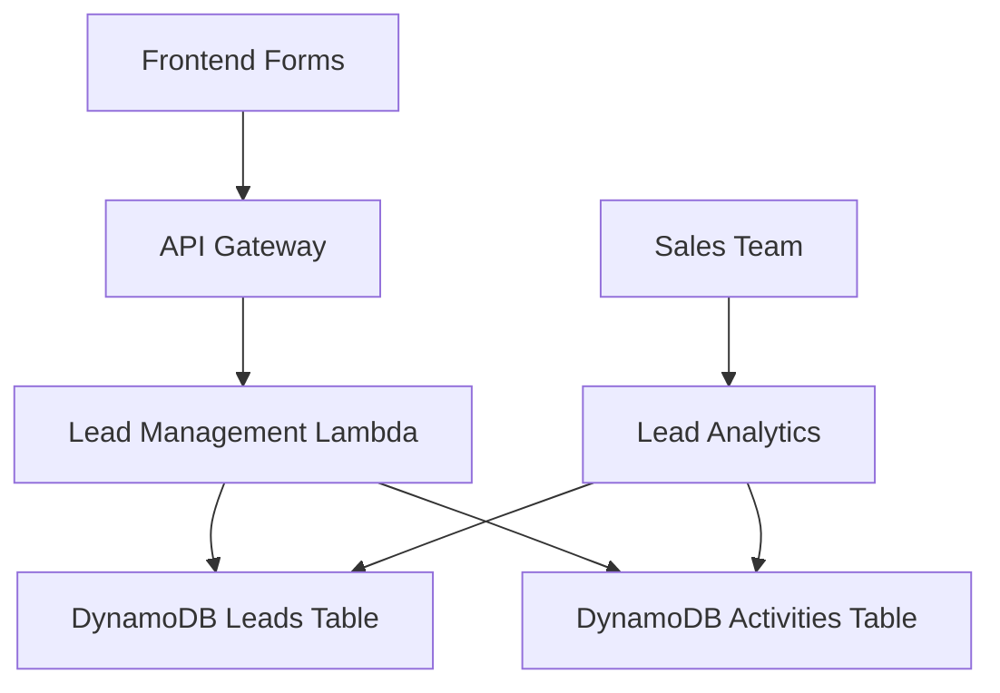

# AI Nexus Workbench - Lead Capture System

> **Complete implementation of lead capture, qualification, and sales pipeline management for AI Nexus Workbench**

---

## 📋 Overview

The lead capture system provides comprehensive lead management functionality that integrates seamlessly with the onboarding flow and pricing page. It includes:

- **Lead Capture**: Collect leads from multiple sources (onboarding, pricing page, enterprise inquiries)
- **Lead Qualification**: Automatic priority scoring based on company size, budget, urgency, and completeness
- **Sales Pipeline**: Lead status tracking, activity logging, and analytics
- **GDPR Compliance**: Consent management and data processing controls

---

## 🏗️ System Architecture

### Backend Infrastructure



**Components:**
- **DynamoDB Tables**: Leads storage with GSI for efficient querying
- **Lambda Function**: Lead CRUD operations, priority scoring, analytics
- **API Gateway**: RESTful API with CORS support
- **Frontend Integration**: TypeScript API client with React components

### Data Models

#### Lead Record
```json
{
  "lead_id": "uuid-v4",
  "created_at": "2025-01-07T20:30:00Z",
  "updated_at": "2025-01-07T20:30:00Z",
  "status": "new|contacted|qualified|converted|lost",
  "priority_score": 75,
  
  "email": "john@company.com",
  "first_name": "John",
  "last_name": "Smith",
  "phone": "+1-555-0123",
  "job_title": "CTO",
  
  "company_name": "Acme Corporation",
  "company_size": "large",
  "company_website": "https://acme.com",
  "company_industry": "Technology",
  
  "use_case": "AI-powered analytics platform",
  "ai_experience": "intermediate",
  "budget_range": "100k-500k",
  "urgency": "next-quarter",
  "team_size": 25,
  
  "lead_source": "enterprise-inquiry",
  "plan_interest": "enterprise",
  "message": "Looking for enterprise AI solution",
  
  "utm_source": "google",
  "utm_medium": "cpc", 
  "utm_campaign": "enterprise-q1",
  "referrer": "https://search.google.com",
  
  "consent_marketing": true,
  "consent_processing": true,
  
  "expires_at": 1735689000
}
```

#### Lead Activity Record
```json
{
  "lead_id": "uuid-v4",
  "activity_id": "uuid-v4", 
  "activity_timestamp": "2025-01-07T20:30:00Z",
  "activity_type": "lead_created|status_changed|email_sent",
  "activity_data": {
    "old_status": "new",
    "new_status": "contacted",
    "sales_rep": "jane.doe@company.com"
  },
  "created_at": "2025-01-07T20:30:00Z",
  "expires_at": 1735689000
}
```

---

## 🚀 Deployment Guide

### Prerequisites

- AWS CLI configured with appropriate permissions
- Terraform >= 1.0
- Node.js >= 18 (for Lambda function)
- jq (for deployment script utilities)

### Quick Deployment

```bash
# Navigate to scripts directory
cd /home/daclab-ai/dev/AWS-DevOps/apps/ai-nexus-workbench/scripts

# Deploy to development environment
./deploy-leads.sh deploy dev

# Deploy to production
./deploy-leads.sh deploy prod
```

### Step-by-Step Deployment

1. **Install Lambda Dependencies**:
   ```bash
   cd ../backend/lambda-leads
   npm install --production
   ```

2. **Initialize Terraform**:
   ```bash
   cd ../infrastructure
   terraform init
   terraform workspace new dev  # or staging/prod
   ```

3. **Plan Infrastructure**:
   ```bash
   terraform plan -var="environment=dev" -var="aws_region=us-east-2"
   ```

4. **Deploy Infrastructure**:
   ```bash
   terraform apply -var="environment=dev" -var="aws_region=us-east-2"
   ```

5. **Verify Deployment**:
   ```bash
   terraform output leads_api_endpoints
   ```

---

## 📡 API Reference

### Base URL
```
https://api-gateway-url.execute-api.us-east-2.amazonaws.com/dev
```

### Endpoints

#### `POST /leads`
Create a new lead.

**Request Body:**
```json
{
  "email": "john@company.com",
  "first_name": "John",
  "last_name": "Smith",
  "company_name": "Acme Corp",
  "company_size": "large",
  "use_case": "AI analytics",
  "budget_range": "100k-500k",
  "urgency": "next-quarter",
  "lead_source": "enterprise-inquiry",
  "consent_processing": true
}
```

**Response:**
```json
{
  "lead_id": "uuid-v4",
  "status": "created",
  "priority_score": 75,
  "created_at": "2025-01-07T20:30:00Z"
}
```

#### `GET /leads`
List leads with optional filtering.

**Query Parameters:**
- `status`: Filter by lead status (new, contacted, qualified, converted, lost)
- `limit`: Number of results (default: 25, max: 100)
- `lastKey`: Pagination token
- `company`: Filter by company name (partial match)
- `priority_min`: Minimum priority score

**Response:**
```json
{
  "leads": [...],
  "count": 25,
  "nextPageUrl": "/leads?status=new&limit=25&lastKey=..."
}
```

#### `GET /leads/{leadId}`
Get a specific lead with activity history.

**Response:**
```json
{
  "lead": {...},
  "activities": [...]
}
```

#### `PUT /leads/{leadId}`
Update a lead.

**Request Body:**
```json
{
  "status": "contacted",
  "sales_rep": "jane.doe@company.com",
  "notes": "Initial contact made via email"
}
```

#### `GET /leads/analytics`
Get lead analytics and statistics.

**Response:**
```json
{
  "summary": {
    "total_leads": 150,
    "by_status": {
      "new": 45,
      "contacted": 60,
      "qualified": 30,
      "converted": 10,
      "lost": 5
    },
    "recent_leads_30d": 22
  },
  "generated_at": "2025-01-07T20:30:00Z"
}
```

---

## 🎨 Frontend Integration

### TypeScript API Client

```typescript
import { leadAPI } from '@/lib/api/leads';

// Create a lead from form data
const response = await leadAPI.createLeadFromOnboarding(
  'company', // userType
  formData,  // form data object
  'onboarding' // source
);

// Create an enterprise inquiry
const inquiry = await leadAPI.createEnterpriseInquiry(
  'john@company.com',
  'John Smith',
  'Acme Corporation',
  'We need an enterprise AI solution'
);

// List leads with filtering
const leads = await leadAPI.listLeads({
  status: 'new',
  limit: 10,
  priority_min: 70
});
```

### React Components

#### Onboarding Integration
The onboarding context automatically creates leads when users complete the flow:

```typescript
const { completeOnboarding } = useOnboarding();

// This creates a lead and shows success/error messages
await completeOnboarding();
```

#### Enterprise Inquiry Modal
Used on the pricing page for enterprise inquiries:

```typescript
import EnterpriseInquiryModal from '@/components/pricing/EnterpriseInquiryModal';

<EnterpriseInquiryModal
  isOpen={showModal}
  onClose={() => setShowModal(false)}
  onSuccess={(leadId) => {
    console.log('Lead created:', leadId);
  }}
/>
```

---

## 🔍 Lead Priority Scoring

The system automatically calculates priority scores (0-100) based on multiple factors:

### Scoring Factors

| Factor | Weight | Scoring |
|--------|--------|---------|
| **Base Score** | - | 50 points |
| **Company Size** | High | startup(20), small(30), medium(50), large(70), enterprise(90) |
| **Budget Range** | High | under-10k(10), 10k-50k(30), 50k-100k(50), 100k-500k(70), 500k+(90) |
| **Urgency** | Medium | immediate(30), next-quarter(20), next-6-months(10), exploratory(5) |
| **Contact Completeness** | Low | phone(10), job_title(10), website(5) |
| **Enterprise Interest** | Medium | enterprise-inquiry(20), enterprise-plan(15) |

### Example Calculation

```javascript
// Lead data:
// - Company size: large (70 points)
// - Budget: 100k-500k (70 points)  
// - Urgency: next-quarter (20 points)
// - Has phone + job title (20 points)
// - Enterprise inquiry (20 points)

const priorityScore = 50 + 70 + 70 + 20 + 20 + 20 = 250
const finalScore = Math.min(priorityScore, 100) = 100 // Capped at 100
```

---

## 📊 Analytics & Reporting

### Built-in Analytics

The system provides several analytics endpoints:

1. **Lead Funnel Analysis**: Conversion rates by status
2. **Source Attribution**: Lead quality by acquisition channel
3. **Priority Distribution**: Score distribution and trends
4. **Company Analysis**: Leads by company size and industry
5. **Geographic Distribution**: Leads by location (if available)

### Custom Queries

Use DynamoDB global secondary indexes for efficient querying:

```sql
-- Get high-priority new leads
SELECT * FROM leads-table 
WHERE status = 'new' AND priority_score >= 80
ORDER BY created_at DESC;

-- Analyze lead sources  
SELECT lead_source, COUNT(*) as lead_count
FROM leads-table
GROUP BY lead_source;

-- Recent enterprise inquiries
SELECT * FROM leads-table
WHERE lead_source = 'enterprise-inquiry' 
  AND created_at >= '2025-01-01'
ORDER BY priority_score DESC;
```

---

## 🔐 Security & Privacy

### GDPR Compliance

- **Consent Tracking**: Separate consent for processing and marketing
- **Data Retention**: Automatic TTL deletion after 2 years (configurable)
- **Right to Erasure**: Manual deletion capability through API
- **Data Minimization**: Only collect necessary fields

### Security Measures

- **Encryption**: Server-side encryption for DynamoDB tables
- **Access Control**: IAM roles with least-privilege permissions
- **CORS Protection**: Configured for frontend domain only
- **Input Validation**: Comprehensive validation on all API endpoints
- **Rate Limiting**: API Gateway throttling (configurable)

### Data Protection

```typescript
// Example: Check consent before processing
if (!leadData.consent_processing) {
  throw new Error('Processing consent required');
}

// Automatic data masking in logs
console.log('Lead created:', {
  leadId: response.lead_id,
  email: '***MASKED***', // Never log sensitive data
  priority: response.priority_score
});
```

---

## 🔧 Configuration

### Environment Variables

**Lambda Function:**
```bash
LEADS_TABLE=ai-nexus-dev-leads
LEAD_ACTIVITIES_TABLE=ai-nexus-dev-lead-activities
AWS_REGION=us-east-2
FRONTEND_URL=https://your-domain.com
```

**Frontend Configuration:**
```typescript
// Update lib/aws-config.ts with API Gateway URL
const config = {
  apiGatewayUrl: 'https://api-gateway-url.execute-api.us-east-2.amazonaws.com/dev'
};
```

### Terraform Variables

```hcl
# infrastructure/terraform.tfvars
environment = "dev"
aws_region = "us-east-2"
domain_name = "your-domain.com"

# Optional overrides
leads_table_billing_mode = "PAY_PER_REQUEST"
lambda_timeout = 30
lambda_memory_size = 256
```

---

## 🔄 Operational Procedures

### Monitoring

1. **CloudWatch Metrics**:
   - Lambda duration and error rates
   - DynamoDB read/write capacity
   - API Gateway request counts and latency

2. **Custom Metrics**:
   - Lead creation rate
   - Priority score distribution
   - Conversion funnel metrics

3. **Alerting**:
   - Lambda errors > 1% 
   - API response time > 2s
   - DynamoDB throttling events

### Backup & Recovery

1. **DynamoDB Backups**:
   - Point-in-time recovery enabled (production)
   - Daily automated backups
   - Cross-region replication (production)

2. **Lambda Versioning**:
   - Automatic versioning on deployment
   - Rollback capability via Terraform

### Maintenance

1. **Regular Tasks**:
   - Monitor lead data quality
   - Review priority scoring effectiveness
   - Clean up test data in development
   - Update UTM campaign tracking

2. **Quarterly Reviews**:
   - Analyze lead conversion rates
   - Review and update priority scoring algorithm
   - Evaluate data retention policies
   - Security audit and updates

---

## 🚀 Usage Examples

### Complete Onboarding Flow

```typescript
// 1. User selects company type
const { setUserType, updateFormField, completeOnboarding } = useOnboarding();

setUserType('company');

// 2. User fills out company information
updateFormField('email', 'john@acme.com');
updateFormField('firstName', 'John');
updateFormField('lastName', 'Smith');
updateFormField('companyName', 'Acme Corporation');
updateFormField('companySize', 'large');
updateFormField('budgetRange', '100k-500k');

// 3. Complete onboarding (creates lead automatically)
await completeOnboarding();
// Result: Lead created with priority score, user redirected to dashboard
```

### Enterprise Inquiry from Pricing Page

```typescript
// 1. User clicks "Talk to Sales" on pricing page
const [showModal, setShowModal] = useState(false);

// 2. Show enterprise inquiry modal
<EnterpriseInquiryModal
  isOpen={showModal}
  onClose={() => setShowModal(false)}
  onSuccess={(leadId) => {
    // Lead created successfully
    toast.success('Thank you! Our team will contact you within 24 hours.');
    
    // Optional: redirect to success page or show next steps
    router.push('/enterprise/thank-you');
  }}
/>
```

### Sales Team Lead Management

```typescript
// List high-priority new leads
const highPriorityLeads = await leadAPI.listLeads({
  status: 'new',
  priority_min: 80,
  limit: 50
});

// Update lead status after contact
await leadAPI.updateLead(leadId, {
  status: 'contacted',
  sales_rep: 'jane.doe@company.com',
  notes: 'Initial call completed, scheduling demo for next week'
});

// Get comprehensive lead analytics
const analytics = await leadAPI.getAnalytics();
console.log('Total leads:', analytics.summary.total_leads);
console.log('Conversion rate:', 
  analytics.summary.by_status.converted / analytics.summary.total_leads
);
```

---

## 🎯 Success Metrics

### Key Performance Indicators

1. **Lead Quality**: Average priority score of generated leads
2. **Conversion Rate**: Percentage of leads that become customers
3. **Time to Contact**: Average time from lead creation to first contact
4. **Source Performance**: Conversion rates by acquisition channel
5. **Sales Velocity**: Time from lead to closed deal

### Expected Outcomes

- **50%+ improvement** in lead data completeness vs. manual forms
- **30%+ increase** in qualified leads through automatic scoring
- **Reduced sales cycle** through better lead prioritization
- **Higher conversion rates** due to better lead qualification
- **GDPR compliance** with proper consent management

---

## 📚 Additional Resources

- **API Documentation**: Generated OpenAPI spec available at `/api/docs`
- **Sales Playbook**: Lead qualification and follow-up procedures
- **Analytics Dashboard**: Custom CloudWatch dashboard for lead metrics
- **Integration Guide**: Connecting with CRM systems (Salesforce, HubSpot)
- **Troubleshooting Guide**: Common issues and solutions

---

**🎉 Your lead capture system is now ready to drive growth for AI Nexus Workbench!**

For questions or support, contact the development team or create an issue in the project repository.