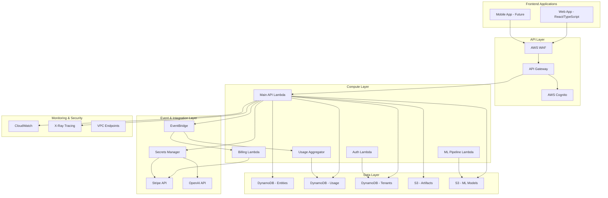

# Diatonic AI Workbench - Backend Architecture

## Overview

The Diatonic AI Workbench backend is a comprehensive serverless architecture built on AWS, designed to support a multi-tenant AI platform with role-based access control, real-time analytics, and scalable compute resources.

## Architecture Diagram



## Core Components

### 1. Authentication & Authorization
- **AWS Cognito User Pool** with custom attributes for tenant and role management
- **JWT token enrichment** via Pre-Token Generation trigger
- **Multi-tier role system** supporting both subscription tiers and internal roles
- **Tenant isolation** enforced at the data access layer

### 2. API Architecture
- **RESTful API** design with versioned endpoints (`/v1/`)
- **Tenant-scoped resources** with pattern `/v1/tenants/{tenantId}/...`
- **Resource-based routing** for projects, agents, experiments, datasets
- **Standardized error handling** and response formats

### 3. Data Model
- **Single-table DynamoDB design** with GSIs for efficient querying
- **Tenant isolation** enforced through partition key patterns
- **Event sourcing** for audit trails and analytics
- **Usage metering** with real-time and batch aggregation

### 4. Security
- **AWS WAF** for DDoS protection and common attack patterns
- **Tenant isolation** at data, compute, and API levels
- **Secret management** via AWS Secrets Manager
- **VPC endpoints** for private AWS service communication

### 5. Monitoring & Observability
- **Structured logging** with correlation IDs
- **Custom CloudWatch metrics** for business KPIs
- **X-Ray distributed tracing** for performance optimization
- **Real-time alerting** for critical system events

## API Endpoints

### Core Resources

#### Authentication
- `POST /v1/auth/signin` - User sign in
- `POST /v1/auth/signup` - User registration
- `POST /v1/auth/confirm` - Email confirmation
- `POST /v1/auth/refresh` - Token refresh

#### Tenants & Users
- `GET /v1/tenants/{tenantId}/profile` - Get user profile
- `PUT /v1/tenants/{tenantId}/profile` - Update user profile
- `GET /v1/tenants/{tenantId}/usage` - Get usage statistics
- `GET /v1/tenants/{tenantId}/billing` - Get billing information

#### Projects (Workspaces)
- `GET /v1/tenants/{tenantId}/projects` - List projects
- `POST /v1/tenants/{tenantId}/projects` - Create project
- `GET /v1/tenants/{tenantId}/projects/{projectId}` - Get project
- `PUT /v1/tenants/{tenantId}/projects/{projectId}` - Update project
- `DELETE /v1/tenants/{tenantId}/projects/{projectId}` - Delete project

#### Agents (Studio/Toolset)
- `GET /v1/tenants/{tenantId}/projects/{projectId}/agents` - List agents
- `POST /v1/tenants/{tenantId}/projects/{projectId}/agents` - Create agent
- `GET /v1/tenants/{tenantId}/projects/{projectId}/agents/{agentId}` - Get agent
- `PUT /v1/tenants/{tenantId}/projects/{projectId}/agents/{agentId}` - Update agent
- `DELETE /v1/tenants/{tenantId}/projects/{projectId}/agents/{agentId}` - Delete agent
- `POST /v1/tenants/{tenantId}/projects/{projectId}/agents/{agentId}/run` - Execute agent
- `GET /v1/tenants/{tenantId}/projects/{projectId}/agents/{agentId}/runs` - List agent runs

#### Experiments (Lab)
- `GET /v1/tenants/{tenantId}/projects/{projectId}/experiments` - List experiments
- `POST /v1/tenants/{tenantId}/projects/{projectId}/experiments` - Create experiment
- `GET /v1/tenants/{tenantId}/projects/{projectId}/experiments/{experimentId}` - Get experiment
- `PUT /v1/tenants/{tenantId}/projects/{projectId}/experiments/{experimentId}` - Update experiment
- `DELETE /v1/tenants/{tenantId}/projects/{projectId}/experiments/{experimentId}` - Delete experiment
- `POST /v1/tenants/{tenantId}/projects/{projectId}/experiments/{experimentId}/start` - Start experiment
- `GET /v1/tenants/{tenantId}/projects/{projectId}/experiments/{experimentId}/results` - Get results

#### Datasets
- `GET /v1/tenants/{tenantId}/projects/{projectId}/datasets` - List datasets
- `POST /v1/tenants/{tenantId}/projects/{projectId}/datasets` - Create dataset
- `GET /v1/tenants/{tenantId}/projects/{projectId}/datasets/{datasetId}` - Get dataset
- `PUT /v1/tenants/{tenantId}/projects/{projectId}/datasets/{datasetId}` - Update dataset
- `DELETE /v1/tenants/{tenantId}/projects/{projectId}/datasets/{datasetId}` - Delete dataset
- `POST /v1/tenants/{tenantId}/projects/{projectId}/datasets/{datasetId}/upload` - Get upload URL

#### Community
- `GET /v1/community/posts` - List public posts
- `POST /v1/tenants/{tenantId}/community/posts` - Create post
- `GET /v1/community/groups` - List public groups
- `POST /v1/tenants/{tenantId}/community/groups` - Create group

#### Analytics (Observatory)
- `GET /v1/tenants/{tenantId}/analytics/usage` - Get usage analytics
- `GET /v1/tenants/{tenantId}/analytics/billing` - Get billing analytics
- `GET /v1/tenants/{tenantId}/analytics/experiments` - Get experiment analytics
- `GET /v1/tenants/{tenantId}/analytics/agents` - Get agent analytics

#### Billing
- `GET /v1/billing/plans` - Get pricing plans
- `POST /v1/tenants/{tenantId}/billing/checkout` - Create checkout session
- `GET /v1/tenants/{tenantId}/billing/subscription` - Get subscription status
- `PUT /v1/tenants/{tenantId}/billing/subscription` - Update subscription
- `DELETE /v1/tenants/{tenantId}/billing/subscription` - Cancel subscription

#### Webhooks
- `POST /v1/webhooks/stripe` - Stripe webhook handler
- `POST /v1/webhooks/external/{provider}` - External service webhooks

### System Endpoints
- `GET /v1/health` - Health check
- `GET /v1/docs` - API documentation

## Database Schema

### Entities Table (Primary)
```
PK: TENANT#{tenantId}#PROJECT#{projectId}
SK: AGENT#{agentId} | EXPERIMENT#{experimentId} | DATASET#{datasetId}

Attributes:
- id: Unique identifier (ULID)
- type: Entity type (agent, experiment, dataset, etc.)
- name: Display name
- description: Text description
- status: Current status (active, archived, etc.)
- config: JSON configuration
- metadata: Additional metadata
- created_at: Creation timestamp
- updated_at: Last update timestamp
- created_by: User ID who created the entity
- tenant_id: Tenant isolation
```

### Usage Table (Events)
```
PK: TENANT#{tenantId}#DATE#{YYYY-MM-DD}
SK: TIMESTAMP#{ISO8601}#{eventId}

Attributes:
- event_id: Unique event identifier
- tenant_id: Tenant isolation
- user_id: User who triggered the event
- resource_type: Type of resource (agent, experiment, etc.)
- resource_id: Specific resource identifier
- action: Action performed (create, update, delete, run, etc.)
- duration_ms: Operation duration
- cost: Associated cost
- metadata: Additional event data
- ttl: Time-to-live for automatic cleanup
```

### Tenants Table (Configuration)
```
PK: TENANT#{tenantId}
SK: CONFIG | SUBSCRIPTION | LIMITS | USAGE#{YYYY-MM}

Attributes:
- tenant_id: Tenant identifier
- name: Organization name
- plan: Subscription plan (free, basic, pro, extreme, enterprise)
- status: Account status (active, suspended, cancelled)
- billing_config: Stripe customer information
- usage_limits: Plan-specific limits
- current_usage: Current period usage
- features: Enabled features
- settings: Tenant-specific settings
- created_at: Account creation date
```

## Security Model

### Authentication Flow
1. User signs in with email/password via Cognito
2. Cognito returns JWT tokens (ID, Access, Refresh)
3. Pre-token generation trigger enriches JWT with tenant and role information
4. Frontend includes JWT in Authorization header for API calls
5. API Gateway validates JWT and extracts claims
6. Lambda functions enforce tenant isolation and role-based permissions

### Tenant Isolation
- **Data isolation**: All DynamoDB operations include tenant ID in partition key
- **S3 isolation**: All objects stored under `/tenants/{tenantId}/` prefix
- **API isolation**: All endpoints require tenant ID in URL path
- **IAM policies**: Conditional access based on tenant context

### Role-Based Access Control
- **Subscription tiers**: free, basic, pro, extreme, enterprise
- **Internal roles**: internal_dev, internal_admin, internal_manager
- **Permission mapping**: Each role maps to specific permissions
- **Feature gates**: API endpoints check required permissions

## Deployment Strategy

### Environment Configuration
- **Development**: Single AWS account, minimal resources, auto-cleanup
- **Staging**: Production-like environment, full feature testing
- **Production**: Multi-AZ deployment, enhanced monitoring, backup enabled

### Infrastructure as Code
- **AWS CDK** for infrastructure provisioning
- **Environment-specific** configurations
- **Cross-stack references** for shared resources
- **Automated testing** of infrastructure changes

### CI/CD Pipeline
- **Source**: GitHub repository with branch protection
- **Build**: Lambda function compilation and optimization
- **Test**: Unit tests, integration tests, security scans
- **Deploy**: Blue/green deployment with automated rollback
- **Monitor**: Real-time health checks and alerting

## Performance Optimization

### DynamoDB Optimization
- **Single-table design** reduces latency and costs
- **Global Secondary Indexes** for efficient query patterns
- **Batch operations** for bulk data processing
- **DynamoDB Streams** for real-time event processing

### Lambda Optimization
- **Connection pooling** for database connections
- **Layer sharing** for common dependencies
- **Memory optimization** based on usage patterns
- **Cold start mitigation** via provisioned concurrency

### Caching Strategy
- **API Gateway caching** for static responses
- **Lambda memory caching** for configuration data
- **DynamoDB DAX** for hot data (if needed)
- **CloudFront CDN** for static assets

## Monitoring and Alerting

### Key Metrics
- **API latency** percentiles (P50, P95, P99)
- **Error rates** by endpoint and tenant
- **Usage quotas** and billing thresholds
- **Security events** and anomalies
- **Resource utilization** (Lambda, DynamoDB, S3)

### Alerting Rules
- **Critical**: API errors > 5%, latency > 10s, security breaches
- **Warning**: Usage approaching limits, elevated error rates
- **Info**: Deployment notifications, quota updates

### Dashboards
- **Operations**: System health, performance metrics
- **Business**: Usage statistics, billing reports
- **Security**: Authentication events, access patterns

## Cost Optimization

### Resource Optimization
- **Pay-per-use** pricing model with DynamoDB on-demand and Lambda
- **S3 lifecycle policies** for automatic archival
- **Reserved capacity** for predictable workloads
- **Right-sizing** based on usage patterns

### Usage Monitoring
- **Real-time cost tracking** by tenant and feature
- **Budget alerts** for cost anomalies
- **Usage analytics** for optimization opportunities
- **Resource tagging** for accurate cost allocation

## Future Enhancements

### Scalability Improvements
- **DynamoDB Global Tables** for multi-region replication
- **Lambda@Edge** for global API distribution
- **Container workloads** for long-running ML tasks
- **Streaming data processing** for real-time analytics

### Feature Additions
- **WebSocket support** for real-time collaboration
- **GraphQL API** for complex data relationships
- **Machine Learning pipelines** with SageMaker integration
- **Advanced analytics** with QuickSight dashboards

This architecture provides a solid foundation for the Diatonic AI Workbench platform while maintaining flexibility for future growth and feature additions.