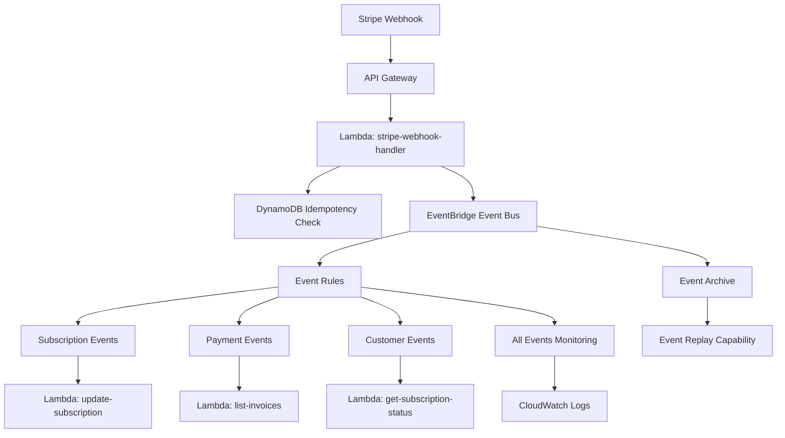

# EventBridge Integration for Stripe Billing

## 🎯 Overview

This EventBridge integration provides a comprehensive event-driven architecture for processing Stripe webhook events. It supports both **snapshot** (complete) and **thin** (essential) payload styles, enabling flexible downstream processing for different use cases.

### Key Features

- ✅ **Dual Payload Support**: Both snapshot and thin payloads for optimal performance
- ✅ **Event Routing**: Automatic routing based on event types
- ✅ **Event Replay**: Built-in archiving for event replay and debugging
- ✅ **CloudWatch Integration**: Comprehensive monitoring and logging
- ✅ **Idempotency**: Webhook idempotency handling in DynamoDB
- ✅ **Tenant Isolation**: Multi-tenant support with proper data segregation

---

## 🏗️ Architecture



---

## 📊 Event Bus Configuration

### Event Bus Details
- **Name**: `ai-nexus-dev-stripe-event-bus`
- **ARN**: `arn:aws:events:us-east-2:313476888312:event-bus/ai-nexus-dev-stripe-event-bus`
- **Source Pattern**: `stripe.webhook`
- **Detail-Type**: `Stripe Webhook Event`

### Event Rules

| Rule Name | Event Types | Target |
|-----------|-------------|--------|
| `subscription_events` | `customer.subscription.*` | `update-subscription` Lambda |
| `payment_events` | `invoice.payment_*`, `payment_intent.*`, `charge.*` | `list-invoices` Lambda |
| `customer_events` | `customer.*`, `checkout.session.completed`, `setup_intent.*` | `get-subscription-status` Lambda |
| `all_events_monitoring` | All Stripe webhook events | CloudWatch Logs |

---

## 🔄 Payload Types

### Snapshot Payload (Complete Data)
```json
{
  "id": "evt_1234567890",
  "object": "event",
  "api_version": "2023-10-16",
  "created": 1686089970,
  "data": {
    "object": {
      "id": "sub_1234567890",
      "customer": "cus_1234567890",
      "status": "active",
      // ... complete Stripe object
    },
    "previous_attributes": {}
  },
  "livemode": false,
  "pending_webhooks": 0,
  "request": {
    "id": "req_1234567890",
    "idempotency_key": null
  },
  "type": "customer.subscription.updated",
  // Additional metadata
  "tenant_id": "diatonicvisuals",
  "processed_at": "2025-09-08T06:40:00Z",
  "payload_style": "snapshot",
  "payload_type": "snapshot"
}
```

### Thin Payload (Essential Information)
```json
{
  "id": "evt_1234567890",
  "type": "customer.subscription.updated",
  "created": 1686089970,
  "livemode": false,
  "tenant_id": "diatonicvisuals",
  "processed_at": "2025-09-08T06:40:00Z",
  "payload_style": "thin",
  "payload_type": "thin",
  // Event-specific essential data
  "object_id": "sub_1234567890",
  "customer_id": "cus_1234567890",
  "status": "active",
  "current_period_start": 1686089970,
  "current_period_end": 1688681970
}
```

---

## 🎨 Configuration in Stripe Dashboard

### Step 1: Add Webhook Endpoint
1. Go to **Stripe Dashboard** → **Developers** → **Webhooks**
2. Click **Add endpoint**
3. Enter endpoint URL: `https://y8t99woj1d.execute-api.us-east-2.amazonaws.com/stripe/webhook`

### Step 2: Select Events
Choose these events for comprehensive billing coverage:

#### Subscription Events
- `customer.subscription.created`
- `customer.subscription.updated`
- `customer.subscription.deleted`

#### Payment Events
- `invoice.payment_succeeded`
- `invoice.payment_failed`
- `payment_intent.succeeded`
- `payment_intent.payment_failed`
- `charge.succeeded`
- `charge.failed`

#### Customer Events
- `customer.created`
- `customer.updated`
- `customer.deleted`
- `checkout.session.completed`
- `setup_intent.succeeded`
- `payment_method.attached`
- `payment_method.detached`

### Step 3: Configure API Version
- Set API Version to: **2023-10-16**

### Step 4: Add Metadata (Optional)
```json
{
  "tenant_id": "diatonicvisuals",
  "app": "diatonic-ai-platform",
  "environment": "dev"
}
```

---

## 🛡️ Security Configuration

### Webhook Signature Verification
The webhook handler automatically verifies signatures using the webhook signing secret stored in AWS Secrets Manager:

```bash
aws secretsmanager put-secret-value \
  --secret-id "arn:aws:secretsmanager:us-east-2:313476888312:secret:/ai-nexus/diatonicvisuals/stripe/webhook_signing_secret-WULq8Z" \
  --secret-string '{"webhook_signing_secret":"whsec_YOUR_SIGNING_SECRET_HERE"}'
```

### IAM Permissions
The webhook Lambda has these EventBridge permissions:
```json
{
  "Version": "2012-10-17",
  "Statement": [
    {
      "Effect": "Allow",
      "Action": ["events:PutEvents"],
      "Resource": [
        "arn:aws:events:us-east-2:313476888312:event-bus/ai-nexus-dev-stripe-event-bus",
        "arn:aws:events:us-east-2:313476888312:rule/ai-nexus-dev-stripe-*"
      ]
    }
  ]
}
```

---

## 📝 Implementation Examples

### Webhook Handler Integration
```javascript
// Environment variables automatically set by Terraform
const ENABLE_EVENTBRIDGE = process.env.ENABLE_EVENTBRIDGE === 'true';
const EVENTBRIDGE_BUS_NAME = process.env.EVENTBRIDGE_BUS_NAME;

// Publish to EventBridge after webhook processing
if (ENABLE_EVENTBRIDGE) {
  await publishToEventBridge(stripeEvent);
}
```

### EventBridge Event Consumer Example
```javascript
// Lambda function receiving transformed events from EventBridge
exports.handler = async (event) => {
  // Event is already transformed by EventBridge input transformer
  const { eventType, customerId, subscriptionId, source } = event;
  
  if (source === 'eventbridge') {
    console.log(`Processing ${eventType} for customer ${customerId}`);
    
    // Process the streamlined event data
    switch (eventType) {
      case 'customer.subscription.updated':
        await updateSubscriptionRecord(subscriptionId, event);
        break;
      // ... handle other events
    }
  }
  
  return { statusCode: 200 };
};
```

---

## 📊 Monitoring and Observability

### CloudWatch Dashboards
Monitor EventBridge performance with these metrics:

#### Event Bus Metrics
- **Namespace**: `AWS/Events`
- **Metrics**: `InvocationsCount`, `FailedInvocations`, `ThrottledInvocations`
- **Dimension**: `EventBusName=ai-nexus-dev-stripe-event-bus`

#### Rule-Specific Metrics
- **Dimension**: `RuleName=ai-nexus-dev-stripe-*-rule`

### CloudWatch Alarms
Automatic alarms are configured for:
- **EventBridge Failed Invocations** > 5 in 10 minutes
- **Lambda Function Errors** > 5 in 5 minutes
- **Lambda Function Duration** > 80% of timeout

### Logs and Debugging
```bash
# View EventBridge logs
aws logs tail /aws/events/stripe-billing --follow

# View webhook handler logs
aws logs tail /aws/lambda/ai-nexus-dev-stripe-stripe-webhook-handler --follow

# View specific Lambda target logs
aws logs tail /aws/lambda/ai-nexus-dev-stripe-update-subscription --follow
```

---

## 🔄 Event Replay and Recovery

### Event Archive
- **Retention**: 90 days (configurable)
- **Name**: `ai-nexus-dev-stripe-events-archive`
- **Pattern**: All `stripe.webhook` events

### Event Replay Process
```bash
# Create replay for specific time range
aws events create-replay \
  --replay-name "stripe-events-replay-$(date +%Y%m%d)" \
  --event-source-arn "arn:aws:events:us-east-2:313476888312:event-bus/ai-nexus-dev-stripe-event-bus" \
  --event-start-time "2025-09-08T00:00:00Z" \
  --event-end-time "2025-09-08T23:59:59Z" \
  --destination '{
    "Arn": "arn:aws:events:us-east-2:313476888312:event-bus/ai-nexus-dev-stripe-event-bus",
    "FilterArns": [
      "arn:aws:events:us-east-2:313476888312:rule/ai-nexus-dev-stripe-subscription_events-rule"
    ]
  }'
```

---

## 🧪 Testing

### Test Event Publication
```bash
# Simulate a test event (requires AWS CLI with appropriate permissions)
aws events put-events \
  --entries '[
    {
      "Source": "stripe.webhook",
      "DetailType": "Stripe Webhook Event",
      "Detail": "{\"type\":\"customer.subscription.updated\",\"id\":\"evt_test123\",\"data\":{\"object\":{\"id\":\"sub_test123\",\"customer\":\"cus_test123\",\"status\":\"active\"}}}",
      "EventBusName": "ai-nexus-dev-stripe-event-bus"
    }
  ]'
```

### Lambda Function Testing
```bash
# Test webhook handler with sample event
aws lambda invoke \
  --function-name ai-nexus-dev-stripe-stripe-webhook-handler \
  --payload file://test-webhook-event.json \
  response.json
```

---

## 🚀 Deployment Status

### ✅ Successfully Deployed Resources

1. **EventBridge Event Bus**: `ai-nexus-dev-stripe-event-bus`
2. **Event Rules**: 4 rules (subscription, payment, customer, monitoring)
3. **Event Targets**: 3 Lambda targets + 1 CloudWatch Logs target
4. **Event Archive**: 90-day retention with replay capability
5. **CloudWatch Monitoring**: Alarms and log groups
6. **IAM Permissions**: EventBridge integration permissions
7. **Lambda Configuration**: Environment variables updated

### 🎯 Ready for Production Use

The EventBridge integration is fully configured and ready to:
- ✅ Receive Stripe webhook events
- ✅ Transform events into both snapshot and thin payloads
- ✅ Route events to appropriate Lambda functions
- ✅ Archive events for replay and analysis
- ✅ Monitor performance and failures
- ✅ Scale automatically with demand

---

## 🔗 Next Steps

1. **Configure Stripe Webhook**: Add the endpoint URL in Stripe Dashboard
2. **Add Webhook Secret**: Store the signing secret in AWS Secrets Manager
3. **Test Integration**: Send test events to validate the flow
4. **Implement Lambda Handlers**: Update Lambda functions to process EventBridge events
5. **Set Up Monitoring**: Create CloudWatch dashboards for observability
6. **Deploy to Staging/Production**: Replicate configuration for other environments

---

## 📚 References

- [AWS EventBridge Documentation](https://docs.aws.amazon.com/eventbridge/)
- [Stripe Webhooks Guide](https://stripe.com/docs/webhooks)
- [EventBridge Event Patterns](https://docs.aws.amazon.com/eventbridge/latest/userguide/eb-event-patterns.html)
- [Lambda Integration with EventBridge](https://docs.aws.amazon.com/eventbridge/latest/userguide/eb-lambda.html)

---

**Configuration Complete! 🎉**

Your Stripe billing system now has a robust, event-driven architecture with EventBridge integration supporting both snapshot and thin payload processing.
